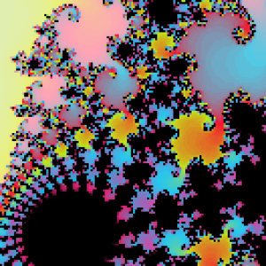

Back in the days of i386 processors, long distance dialup connections and 5.25" floppy drives, I spent a lot of time with a program called [FractInt](http://spanky.triumf.ca/www/fractint/fractint.html). You could pick an algorithm, set up the location, zoom level and color palette and then wait minutes, hours or days for it to calculate a TOTALLY AWESOME image.

Now that processors are screaming fast and AS3 is about catching up to the speed of real programming languages, I decided to port the Mandelbrot algorithm and see how fast it could be rendered. This 132x132 image is being calculated each frame with up to 200 iterations per pixel.

<!-- swfobject.embedSWF("http://www.beigerecords.com/joe/sites/default/files/mandelbrotset.swf", "mandelbrot", "132", "132", "9.0.0"); // -->

Z = zoom in
X = zoom out
mouse = pan

[source](mandelbrotset.as) 
  