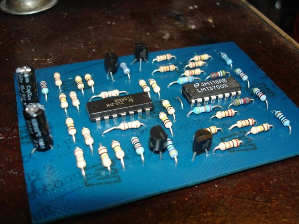

Just finished a new dual VCA as described [here](http://www.musicfromouterspace.com/analogsynth/newdualvca.html) . I had the board sitting around half done all summer. 

 

The worst haphazard panel layout I have done yet. [<source src="ringmod_sine_sample.mp3"></audio>

