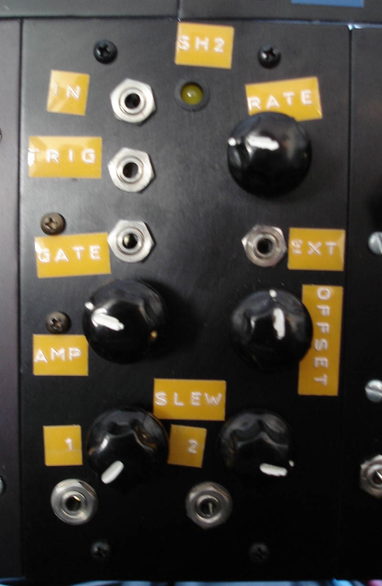

Really nice sample-and-hold as described [here](http://www.musicfromouterspace.com/analogsynth/NewAugustNewSampleHold.html). Internal or external clock, gate/trigger outputs, amplitude and offset settings for the CV and two outputs with individual glide controls.

Obligatory white noise input patch:

<audio controls="controls" preload="auto" autobuffer="autobuffer" xmlns="http://www.w3.org/1999/xhtml"><source src="sh2_noise_demo.mp3"></audio>

