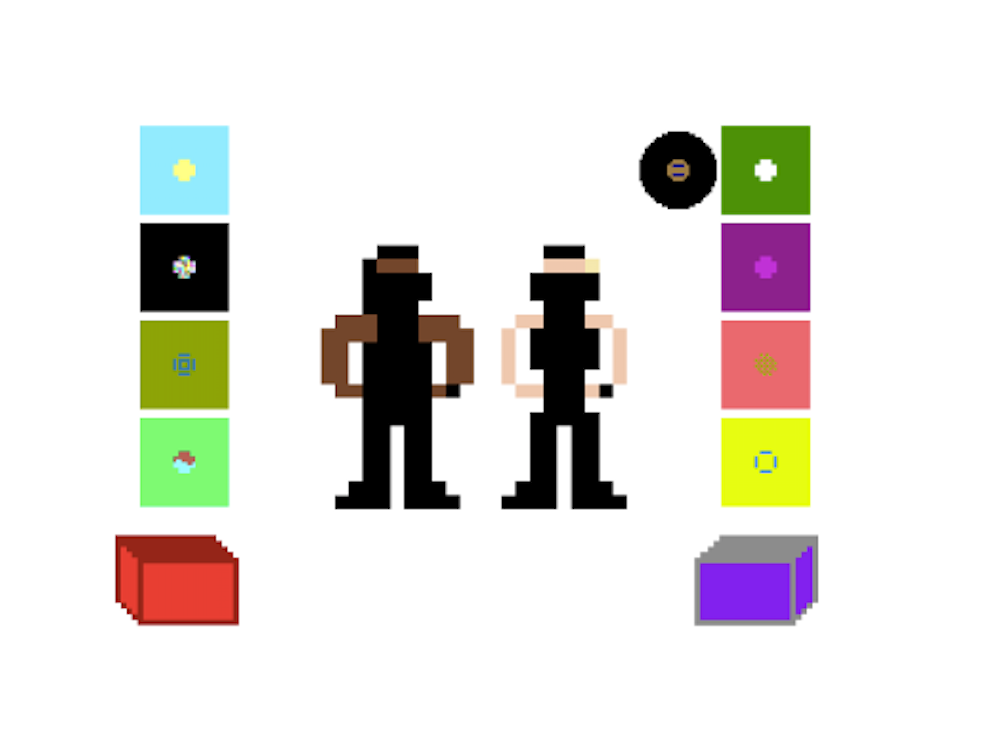

I made this flash deally for the St. Louis -based Dj crew. The tracks used to sync up in the old Flash player...

<object type="application/x-shockwave-flash"
  data="/sa.swf"
  width="400" height="400">

  <param name="movie" value="/sa.swf" />
  <param name="quality" value="high"/>
</object>

(needs flash)
