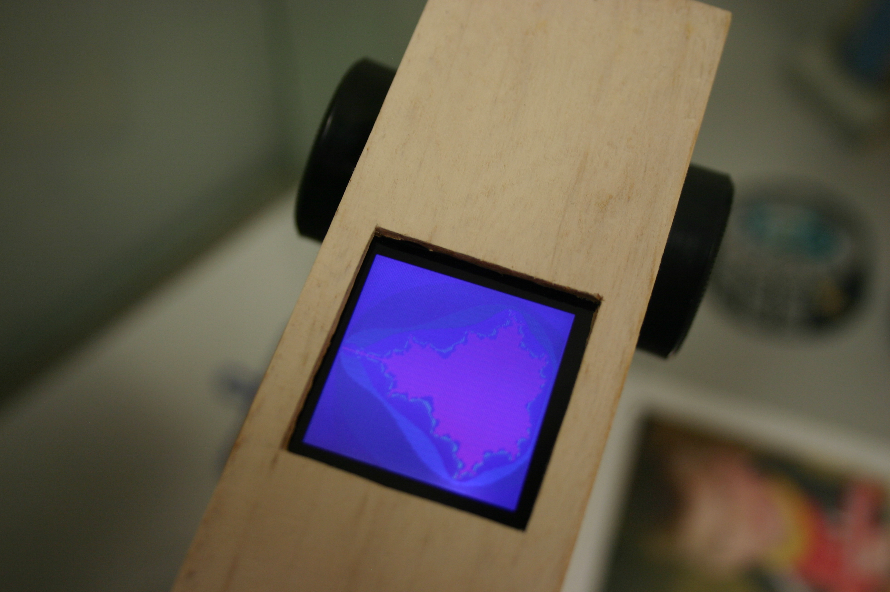

This code draws a Mandelbrot pattern on the 132x132 Nokia 6100 type screen with Epson controller (will not work for the Phillips) from an [Arduino](http://arduino.cc). I started with the code example from [this post](http://www.arduino.cc/cgi-bin/yabb2/YaBB.pl?num=1237036119/45) and made some optimizations- especially to the serial communication code. Then I ported the Mandelbrot algorithm from [here](http://www.codeproject.com/KB/cpp/mandelbrot_obfuscation.aspx). The zoom level and viewport into the fractal can easily be changed or made to update each loop. But it's slow.

[source](mandelbrot_zoomer.pde)

To send serial data a bit faster, one might reserve an entire Arduino port and rotate/clock, rotate/clock and so on, instead of repeatedly testing the data byte and flipping a single pin. I still haven't been able to engage the 8-bit color mode, which would again speed things up since I could send one byte per pixel instead of three bytes for two pixels. I used an 8Mhz and would only use 16Mhz or higher setup if I did this again. When will there be a 2Ghz Arduino? Then it might look more like this:

(needs flash)

<object type="application/x-shockwave-flash"
  data="/mandelbrotset.swf"
  width="132" height="132">

  <param name="movie" value="/mandelbrotset.swf" />
  <param name="quality" value="high"/>
</object>

(mouse left/right for pan, up/down for zoom)
