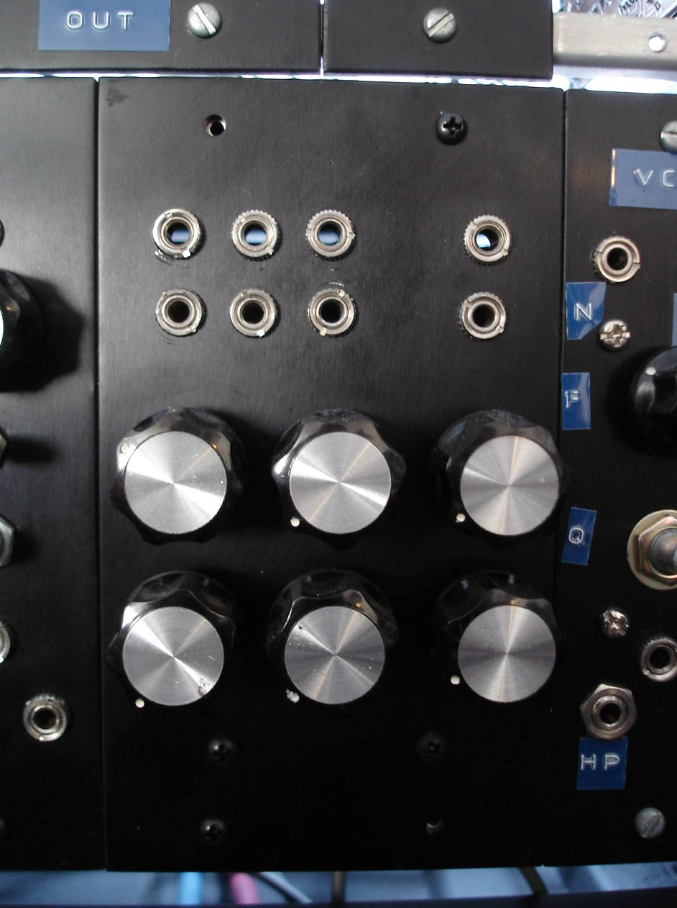

I love this very simple, very functional mixer. The circuit is so simple I just used a little piece of perf board. No need for labels here:

  <!---
  

    

            

                            

        

I love this very simple, very functional mixer.  The circuit is so simple I just used a little piece of perf board.  No need for labels here:

 

I love this very simple, very functional mixer.  The circuit is so simple I just used a little piece of perf board.  No need for labels here:

 

 6
  --->
