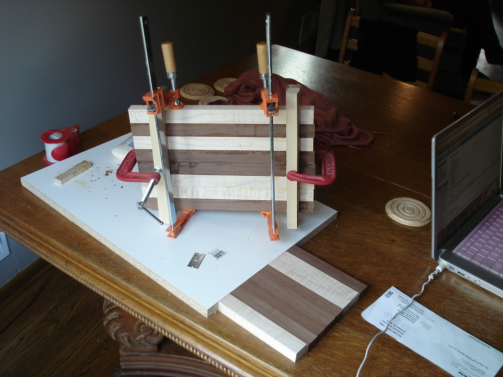
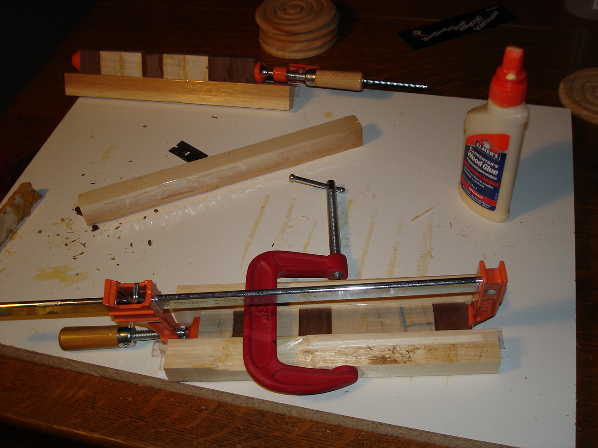
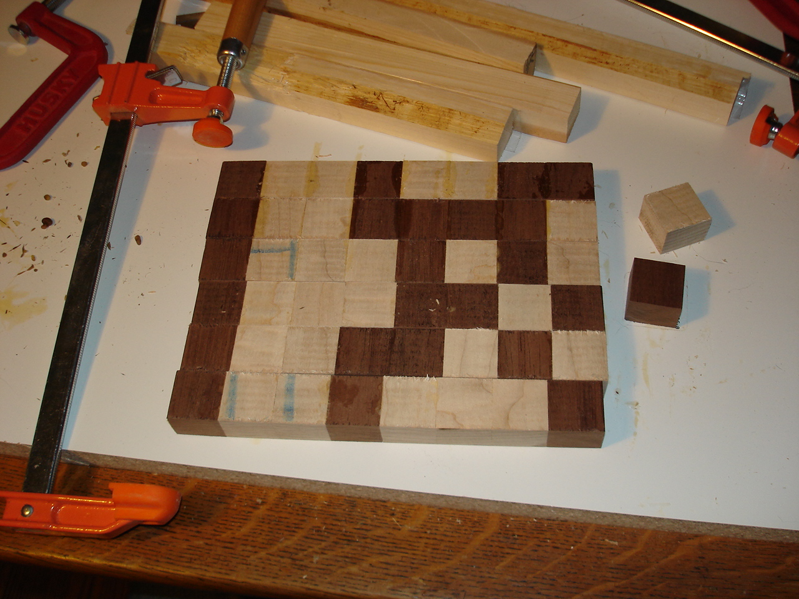
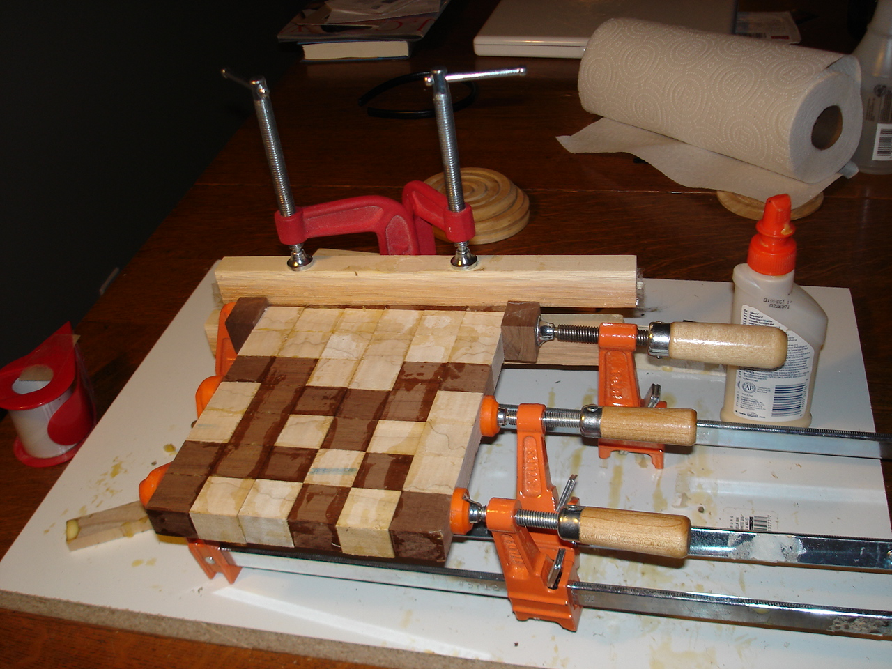
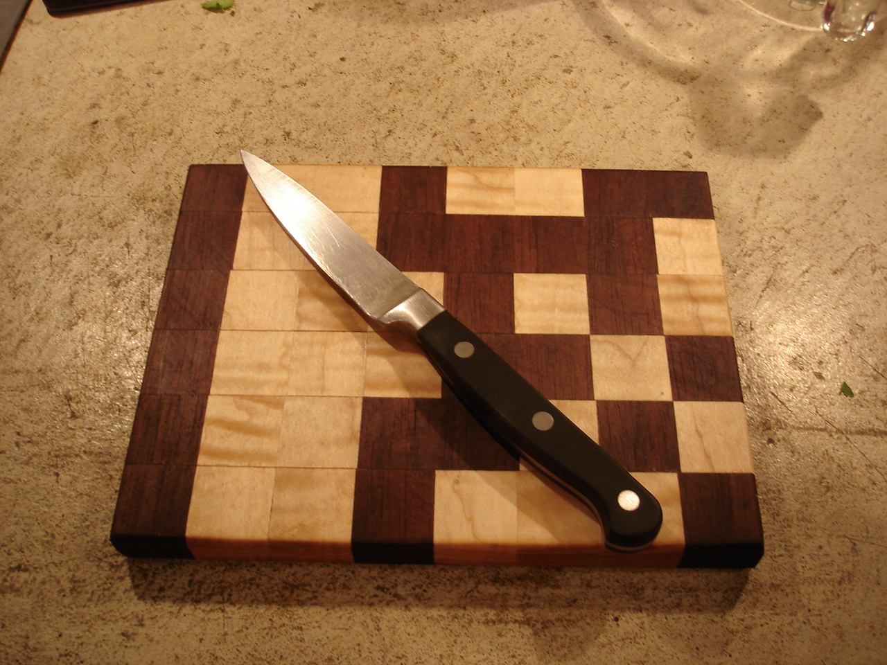

Lauren gave me a classic 10" radial arm saw for my birthday after we moved (and have a garage). I've been testing its ability to cut accurately. Ripping this walnut and maple to one inch felt reasonably dangerous and I'll probably build the jig suggested in the original manual for ripping small stock.

This row encodes the [ASCII](http://en.wikipedia.org/wiki/Ascii) character "e". "a" is sitting on the table. 

I decided the next cutting boards will be end-grain, so the rest of the letters for this one should be glued from single squares. This produces a less-accurate row but got the job done. 

 

Here are the rows of the word I planned to spell. 

 

I let the last glue setup cure for 72 hours. 

Sanded flat, edged on the router table, wetted to raise the grain and sanded to a smooth finish. Then, mineral oil. Extra points if you can tell me what word is encoded. 