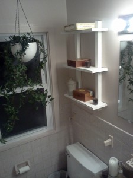

Lauren asked me to copy a shelf seen at West Elm for our bathroom.

I fabricated the five pieces of oak and made this type of steel hanger to be self-contained and keep close to the wall.

A happy customer

