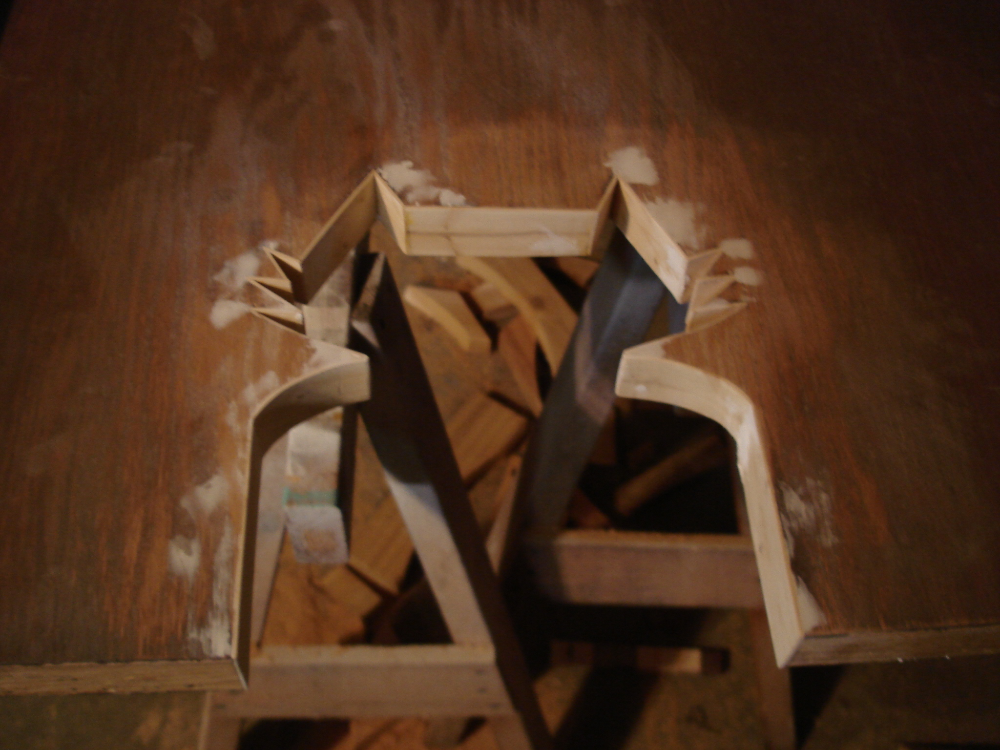

 

The door between basement ping pong room and basement laundry/toilet room needed to allow for cats' access to the litter box. Lauren had the perfect idea: we would make a cat-shaped hole that would allow cats but no dog through. Mitch Loidolt kindly drew for us a feline outline.

Some thin slices of scrap wood spanned the cutout.

wood filler / sanding / repeat

primer

paint

Not a chance for Clementine.

Gatsby has a safe zone now.

