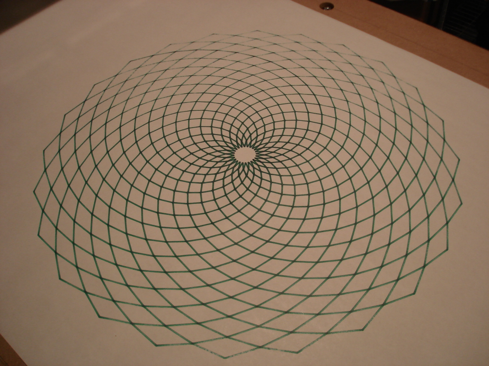

 

Motors installed and wired to controller / controller connected to PC. I jogged each axis end to and repeatedly to shift things into place, tightening a little each trip. Things are looking pretty well square after building a sharpie holder and jogging in large rectangles. Here is an old javascript/easelJS drawing pattern I made, now adapted to output g-code. Router mount on the way. For now, I have an overly powerful plotter / sharpie ruiner.

