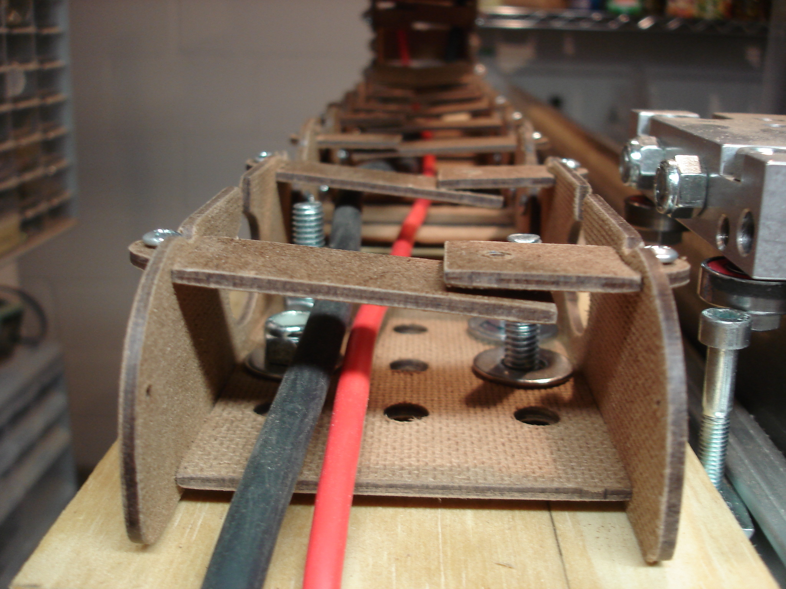
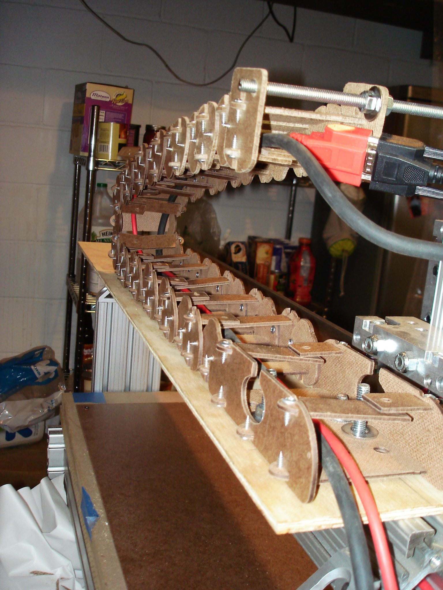
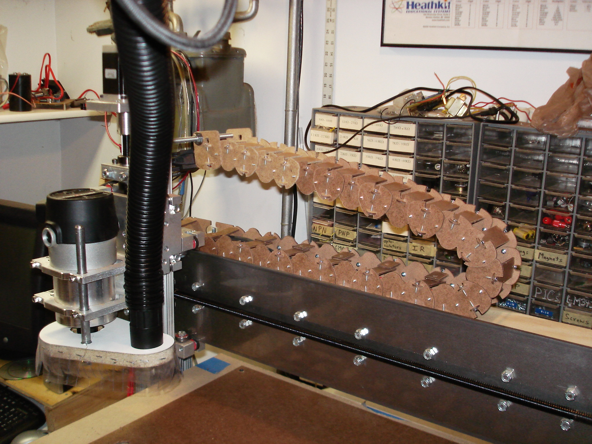
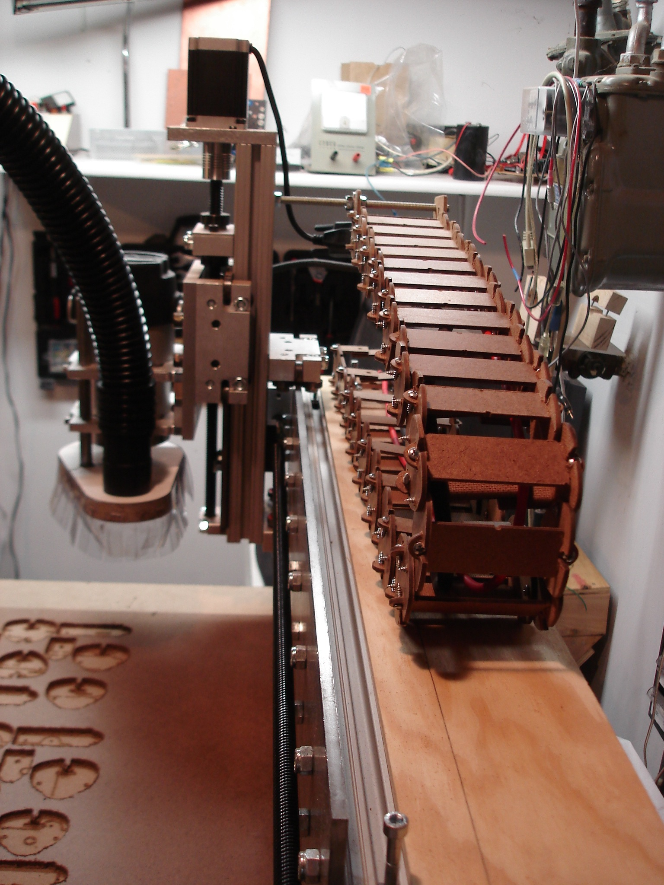

 

There is a great cable tray design shared online by Kronos Robotics at [http://www.kronosrobotics.com/krmx01/krmx01upgrades/dragoncable/](http://www.kronosrobotics.com/krmx01/krmx01upgrades/dragoncable/)

This made for a perfect "first cuts" project with my router. One learns a lot of things quickly in the first few hours operating a router like this. Work has to be held down very firmly to produce the shape accurately. And a cable tray like the Dragon is very necessary to keep cables safely away from the bit and from being stretched across parts of the machine.
