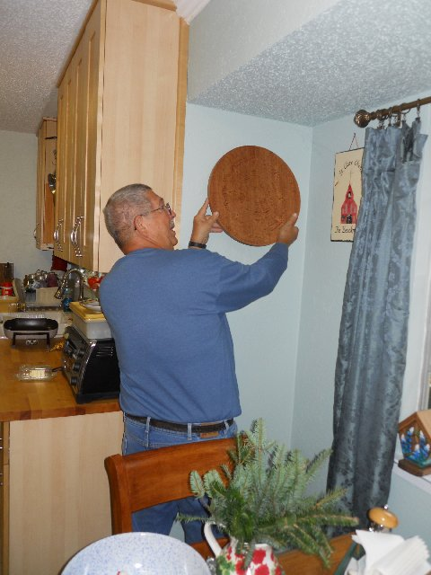

 

The g-code for a detailed aztec calendar is a well-known benchmark around cnczone.com. To cut this pattern, the machine has to make thousands of movements staying within a few hundredths accurate. I tried cutting one for my parents' xmas present from some nice brazilian cherry. I joined two planks to get the required 16" width, flattened the top and sprayed a light coat of polyurethane to help avoid chipping during the lighter detail passes. Next time I would apply a thick layer of poly since a few detailed places show some chipping.

These were taken about an hour in.

  

lots of burrs to clean up by hand...

around two hours...

It took about three hours but came out very well.

I carefully added a circle about 1/4" outside the pattern to cut the calendar from the stock.

ready for cleanup and a few light coats of poly

I think they liked it!

 