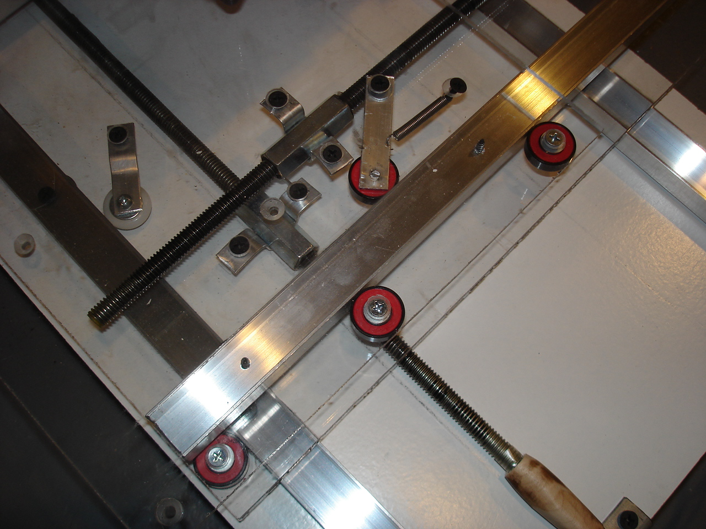
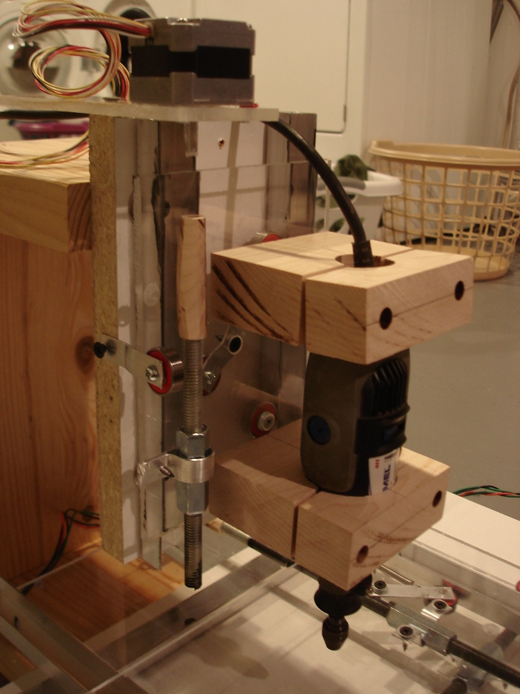
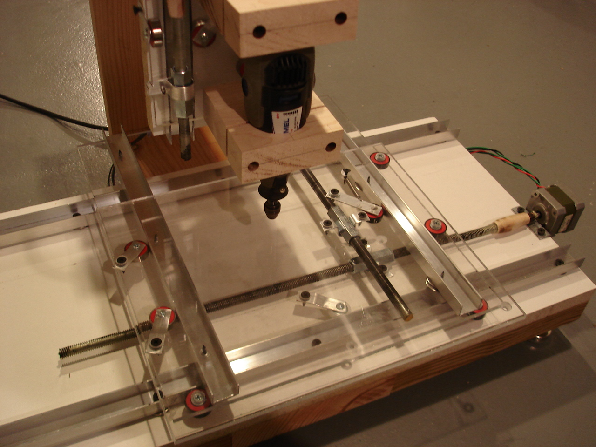

I've been reading loads of posts from cnczone.com, which is an incredible resource. This design based on an instructables.com article has clearly become a tool to learn about the mechanisms involved, rather than a desirable machine.

I picked up an [old PC](http://www.pcworld.com/reviews/product/13971/review/dimension_8200_24ghz.html) with CRT monitor for $30 on craigslist which is more than adequate for CNC. I made a boot-cd with [TurboCNC](http://www.dakeng.com/turbo.html) and used an [EasyDriver](http://www.schmalzhaus.com/EasyDriver/) board to test the X and Y axes. It turns out that tubing will torque-couple the motor to the threaded rod, but can not keep them coaxial and concentric. There was some binding and the axes were not viable, at least at the small current and voltage available from the EasyDriver. I got the axes moving decently at slow speeds but will need at least the rated power of these stepper motors to move them well. To reduce friction as much as possible, I swapped the aluminum slider guides for skate bearings, which conveniently use the same holes. All but one of the plastic Menards guide wheels are also replaced by skate bearings. I drilled concentric holes in pieces of hard maple to serve as replacement shaft couplers to reduce binding. Hot glue holds them in place.

  
 
 
I tested the EasyDriver beyond its rated 30V and promptly smoked it. I think it's a great driver board but not for this purpose. Hopefully, supplying my steppers with their rated current and extra voltage will make them viable for this machine. It's obvious from dozens of posts on cnczone.com that the [Gecko G540 CNC Controller](http://geckodrive.com/product.aspx?c=3&i=14469) is the best choice for this machine and will be able to control much larger/better machines if I build one of those. I'm saving for the G540 and will be testing with that asap.

In the mean time, I built up the rest of the Z axis.

 

Even with skate bearings replacing the aluminum slides and plastic alignment wheel, this axis is probably too difficult to move with the cheap stepper. I will be testing at full power when the Gecko arrives but could see having to upgrade at least the Z motor.

Lesson: Cutting corners to save a few bucks often leads to a complicated or unusable machine. For instance, the skate bearings are barely more expensive than the plastic wheels were, but provide a low-friction replacement with very tight tolerances. The motors were cheap but aren't adequate for this size of machine. Same for the $15 EasyDriver, RIP.