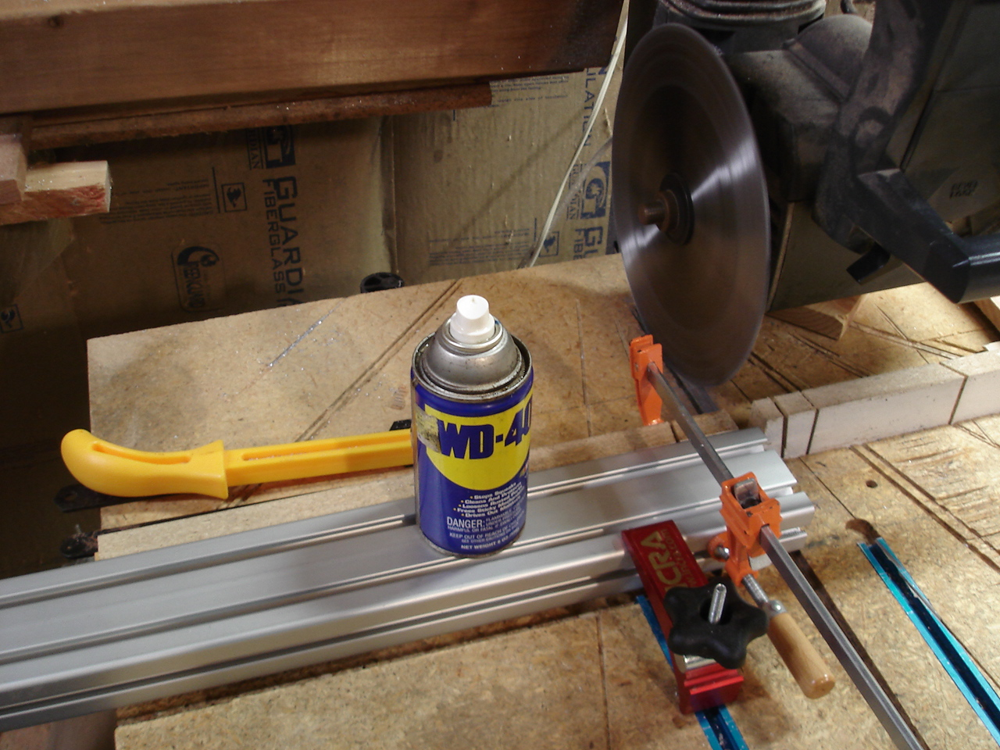
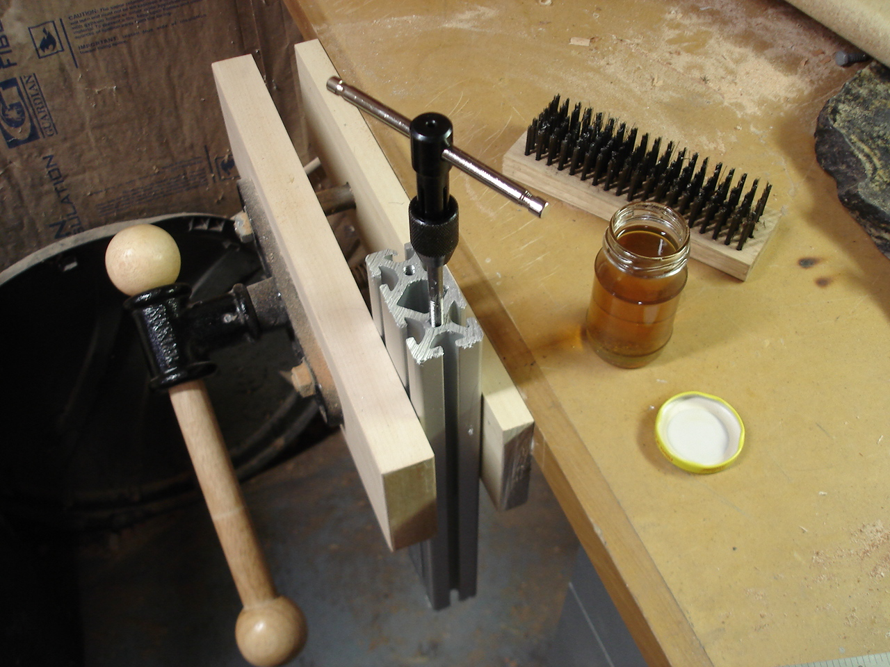
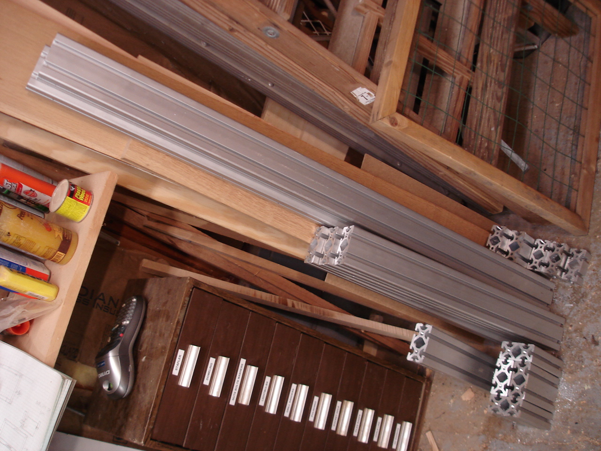

My first departure was a learning experience but is over. The cost of good motors and the gecko controller call for a machine with commensurate capabilities to be worthwhile. Fine Line Automation offers a popular kit called FLA-100 and posts free plans for the machine on their website. I decided to save for the entire kit and electronics. Then ABC Electronics got in a good load of 80/20 and my willpower gave out. A little at a time, my FLA-100 clone begins. 

This is a cheap sacrificial multipurpose blade. Very slow and steadied feeds gave an acceptable finish even without lube. I sprayed WD40 continuously to trim the more important lengths and got a nicer finish than I expected with the Craftsman.

There is a considerable amount of tapping involved.

Here are the parts for the base and leftover bits. I realized after buying that this 80/20 is metric 40mm-based instead of 1-1/2" per the plan. I ordered 2-1/2" 1018 rails from DiscountSteel.com to drill myself so that the overhang is 1/2" for the carriages from CNCRouterParts.com. Luckily, everything else works out if I switch to 1-1/2"-based 80/20 from the carriages on.
