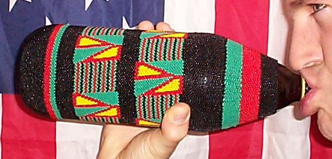

 

** substrate:

Miller Brewing Company 40oz brown glass bottle 

** cover: 

size 11 seed beads peyote stitched on black size d nylon thread 

** kente cloth pattern:

adwinasa - literally means "all motifs are used up." the cloth was viewed as one of the top quality, and the most prestigiou 

