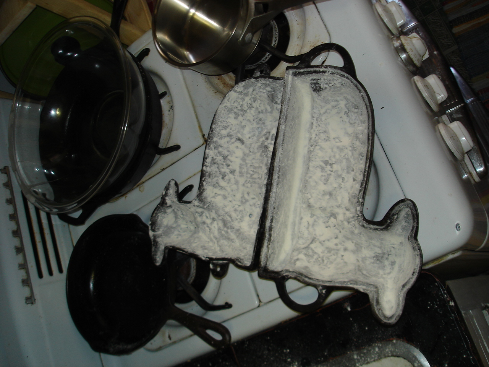
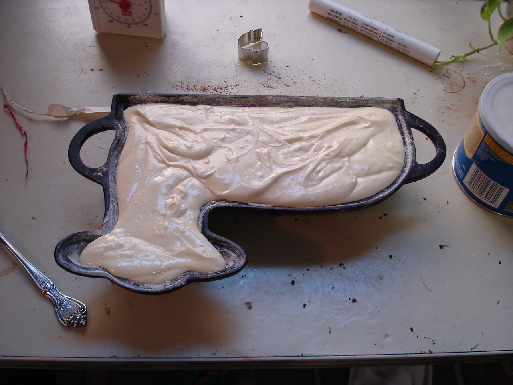
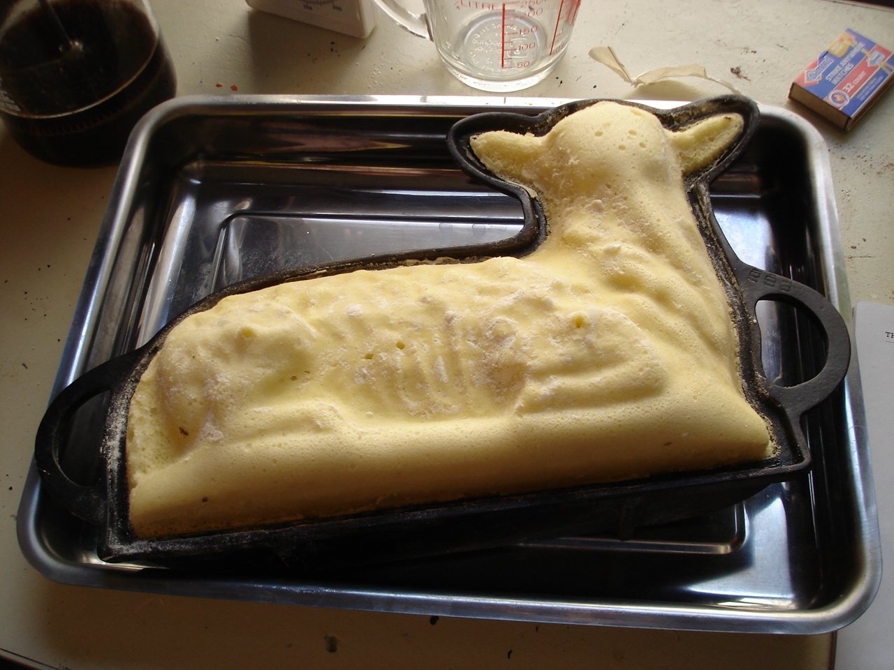
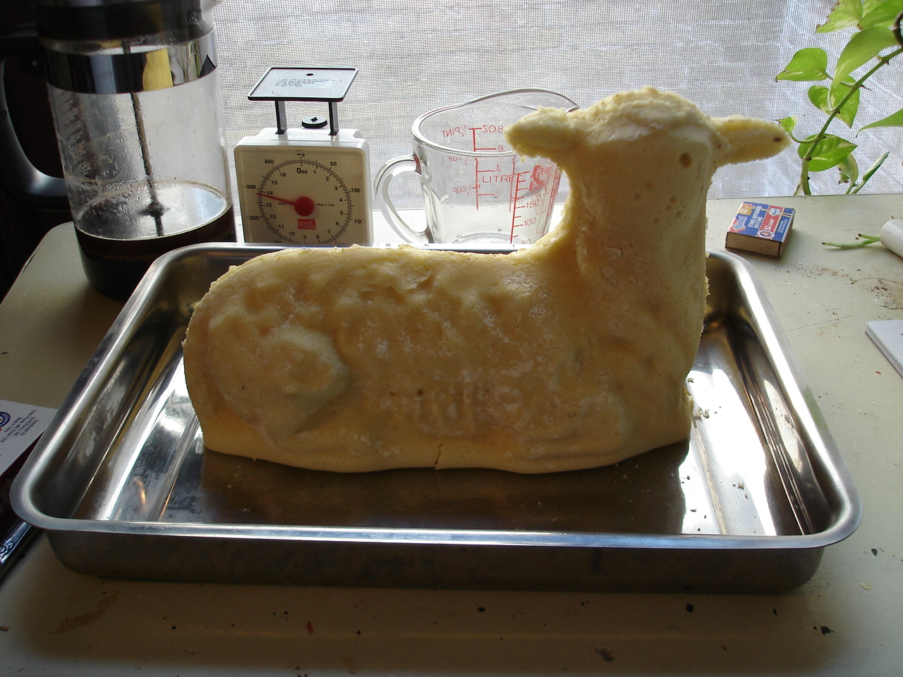
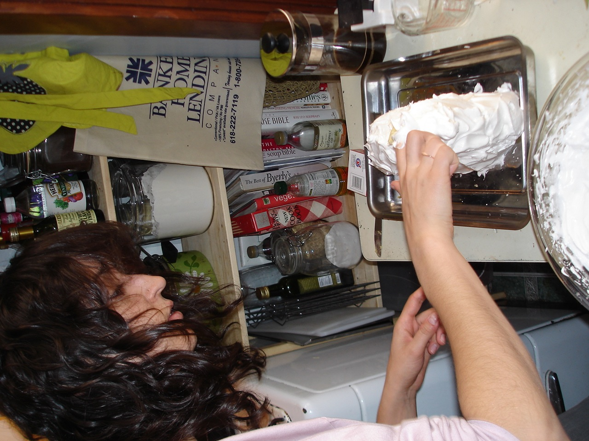
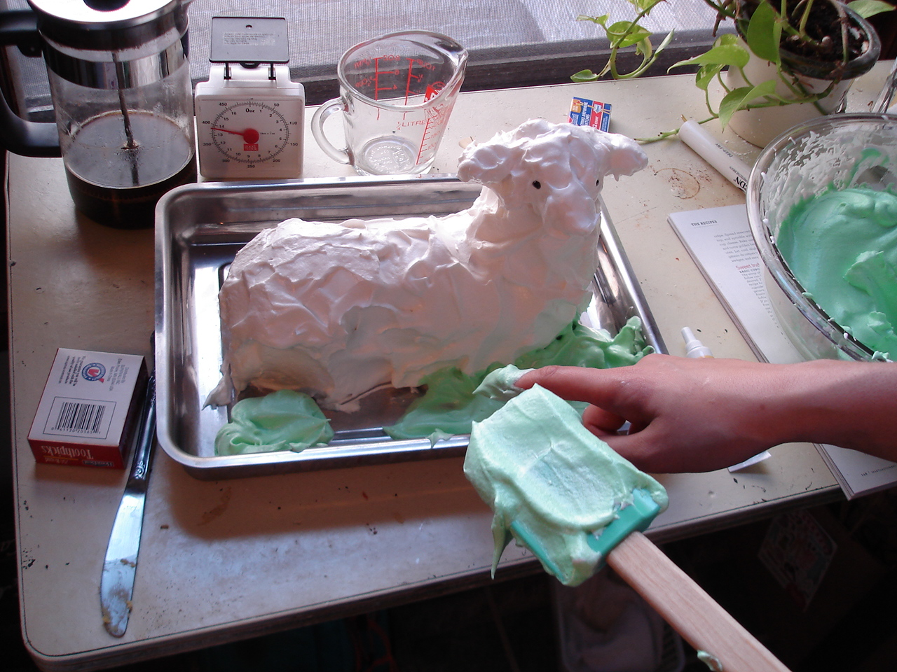
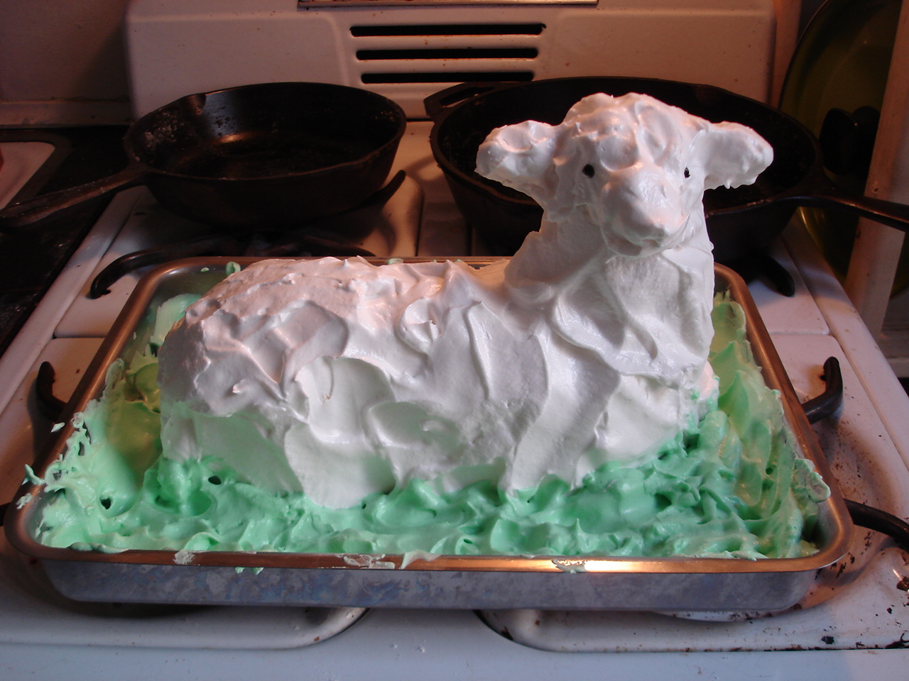

Grandma Beuckman made a lamb cake every Easter growing up, so I laughed a bit when Lauren's mom produced their iron lamb cake mold. She gave it to Lauren (wizard of desserts) to try this year and I think we restarted their tradition today. An attempt yesterday afternoon failed miserably so I decided to document today's go in case we got it right. And we did, somewhat. 

All criscoed up and floured

Batter up.

No face? More batter in the head next year...

We decided the outside of the mold looks more like a lamb. The inside shape is creepy. But it stands!

7-minute frosting was difficult to control but light enough not to pose much risk of further damage to the lambage and also great for the facial reconstructive surgery.

Careful not to get green on the white!

Baaa

 

