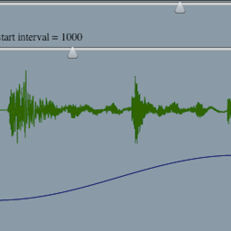

 

var flashvars = { }; //servicesUrl: "FlashService.aspx" var params = { allowNetworking: "true", allowscriptaccess: "always" }; var attributes = { id: "flashcontent", name: "flashcontent" }; swfobject.embedSWF("/joe/sites/default/files/Granular.swf", "flashcontent", "640", "360", "10.0.0", false, flashvars, params, attributes);

An upcoming client project presents an opportunity to experiment with granular synthesis in Flash Player 10. The idea is to play back lots of little pieces (grains) of a sound at various times to create a new sound. In this demo, grain playback is accomplished by maintaining a list of GrainDescription objects which store where in the sample the grain started and how much has been played. Then for each sample of output, iterate through the list of grains and add the value of the original sound at each active grain’s current position marker. Grains are added at a given interval and removed when they have played a given amount of time.

 

This element requires Flash 10.

This demo provides controls for how fast to move through the sound spawning new grains, how fast to play the grains (pitch), how many samples long each grain should be (length) and how many samples to wait between starting new grains (interval). The green waveform shows the shape of the complete sample. The blue waveform is the shape of the envelope used to scale the amplitude of a grain over its lifetime. This grain envelope shape is the function sin(x)\*sin(x) where x runs between zero and pi. Individual grains fade in and out smoothly to avoid the transients (clicks and pops) that would occur if short chops of audio were played directly.

enjoy [source code](Granular.zip)

16 
  <!---
  

      
    

            

                            

        

 
	  
	  

 
An upcoming client project presents an opportunity to experiment with granular synthesis in Flash Player 10. The idea is to play back lots of little pieces (grains) of a sound at various times to create a new sound. In this demo, grain playback is accomplished by maintaining a list of GrainDescription objects which store where in the sample the grain started and how much has been played. Then for each sample of output, iterate through the list of grains and add the value of the original sound at each active grain’s current position marker. Grains are added at a given interval and removed when they have played a given amount of time.
 

 

<input type="button" onClick="javascript:document.getElementById('flashcontent').start();" value="play"/>
<input type="button" onClick="javascript:document.getElementById('flashcontent').stop();" value="stop"/>

 

 

	This element requires Flash 10.

 

 
This demo provides controls for how fast to move through the sound spawning new grains, how fast to play the grains (pitch), how many samples long each grain should be (length) and how many samples to wait between starting new grains (interval). The green waveform shows the shape of the complete sample. The blue waveform is the shape of the envelope used to scale the amplitude of a grain over its lifetime. This grain envelope shape is the function sin(x)*sin(x) where x runs between zero and pi. Individual grains fade in and out smoothly to avoid the transients (clicks and pops) that would occur if short chops of audio were played directly.
 

 
enjoy <a href="/joe/sites/default/files/Granular.zip">source code</a>
 
 16
  --->