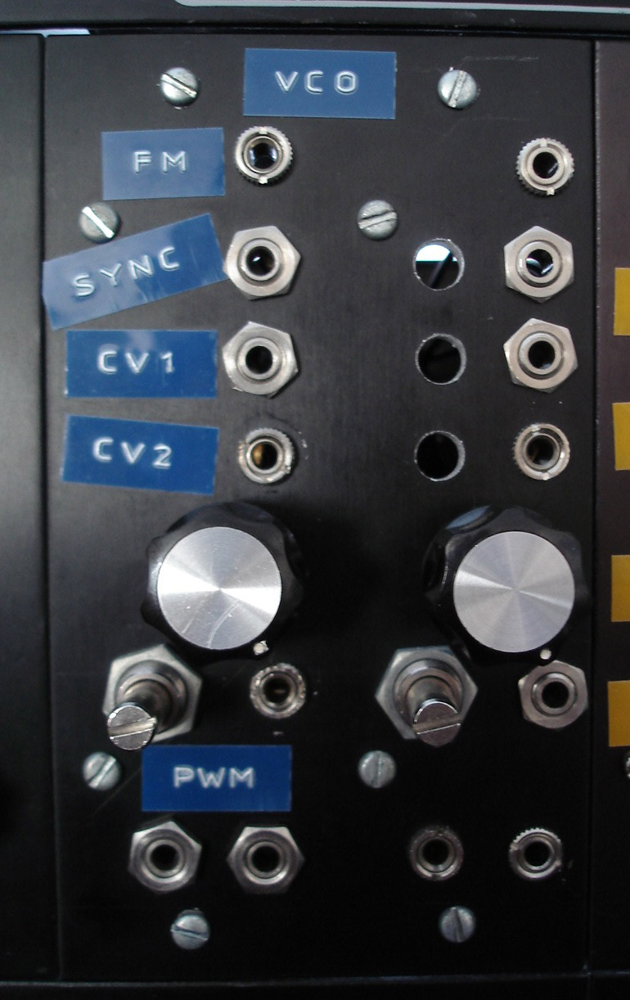

Maybe 10 years ago I had put together a dual VCA, dual EG and dual VCF from [PAiA](http://www.paia.com/) kits. They worked great but have mostly sat unused because PAiA ran out of the chips in their VCO kit and no VCO = very little fun. This spring I looked again and found a great DIY synth community on the internet. The ASM VCO #3 had parts I could find and seemed viable so I built up two of them: 

 

These were my first PCB etchings in a long time and first things that I mounted in the frac-rack. I had several trace-patches to do and calibrated these mostly by ear. The back side is a nightmare but they work great. Thankyou for Charlie Lamm for [PC layout](http://www.charlielamm.com/synth/asmvco.php3) and troubleshooting help. 