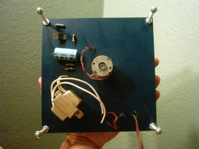
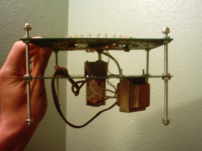
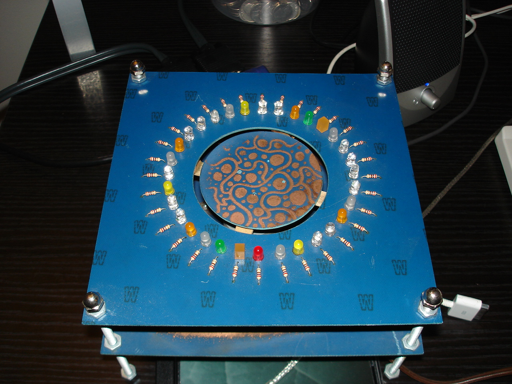

The fire stand is designed as a display stand for my beaded bottles - blucka bluck, cna yoohoo, etc. The idea was to make a display that made it appear that the bottle was lit by campfire. A platform holding the bottle rotates, showing the bottle from all sides and also moving powered contacts around under a circle of LEDs which flicker with many colors. 

 

 

 