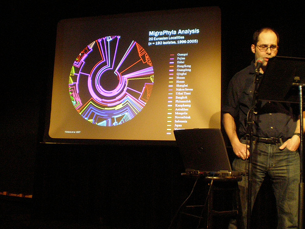

Robert Wallace had me select and DJ music for his presentation about Bird Flu. We ran through his talk for his geography class at the U of M the Friday before spring break and then did our fancy performance at Bryant Lake Bowl on St. Patrick's day evening for Cafe Scientifique. 

  

[M.I.A.](http://www.youtube.com/watch?v=D6iEe_1kWqA) was an obvious choice, and Barron, Mike and Paul sent me awesome selections for the occasion. But, I have to say [the most perfect track idea](http://www.youtube.com/watch?v=L2PmmEObVLU) (and the one with the greatest crowd reaction) was from [Lauren Michele Manke](http://oakened.blogspot.com/) .

Top Five Bird Flu Tracks:

5\. M.I.A. - Bird Flu  
4\. Miami - Chicken Yellow  
3\. Mr. Scruff - Chicken in A Box  
2\. Cibo Matto - Know Your Chicken  
1\. Prince - When Doves Cry  
