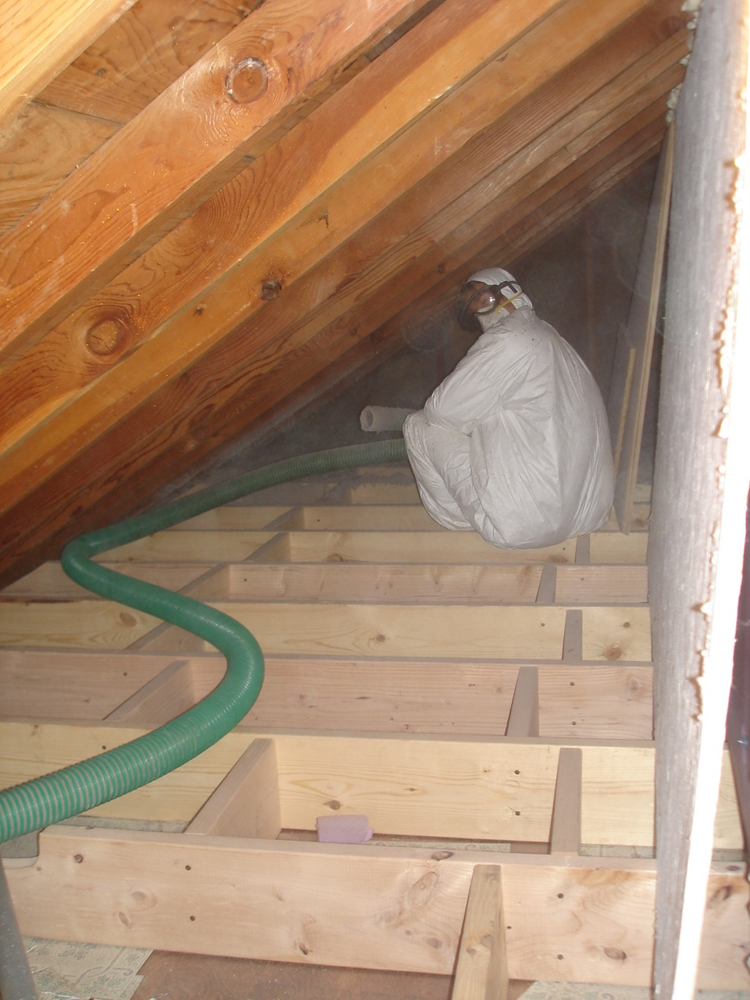

I raised the attic floor with a 2x8 frame and blew in cellulose insulation. Master insulation machine operator Jay Manke loaded the bales down in front. The cellulose is extremely dusty and difficult to contain. 
  
   
