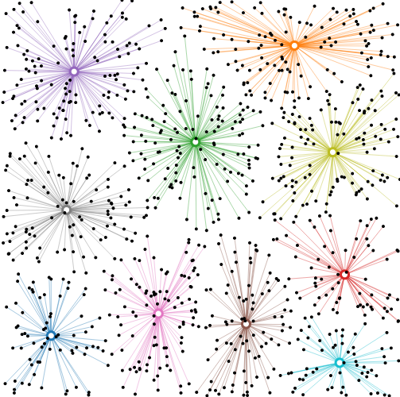

Earlier this summer, I was lucky enough to be given a month and a pile of bank data to develop tools and skills for visualizing the data. I can't show any of the visualizations for privacy of the bank customers. But, working with the vast dataset presented a need to categorize bank customers by highly-dimensional demographic data. I implemented the basic K-Means algorithm with Javascript. With around ten thousand vectors to categorize, this algorithm was performant enough not to be sluggish in Javascript. If you have HD data to categorize, please check out the code and report issues or comments.

Demo: [http://bl.ocks.org/jbeuckm/5731501](http://bl.ocks.org/jbeuckm/5731501)

Code: [https://github.com/jbeuckm/K-Means](https://github.com/jbeuckm/K-Means)
