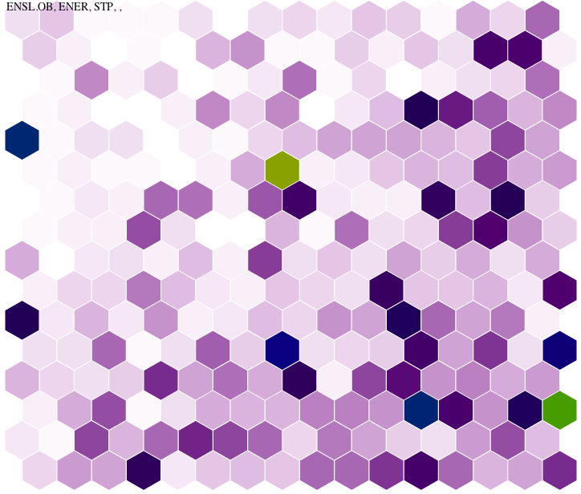

 

I've been having a hard time [trying](http://www.punyblog.com/2009/12/self-organizing-maps.html) to train a [Self-Organizing Map](http://en.wikipedia.org/wiki/Self-organizing_map) to categorize a large pool of short documents by my selected keywords. The initial results were promising but I couldn't adjust the training parameters well enough to train the error sufficiently low that I would be confident of the categorizations, even after several days of training.

Some nice folks on [comp.ai.neural-nets](http://groups.google.com/group/comp.ai.neural-nets/topics) suggested a few other techniques and I've implemented simple routines to perform [K-Means Clustering](http://en.wikipedia.org/wiki/K-means_clustering). The categorization of my 3300 documents by 323 keywords now takes less than 10 seconds.

[download my k-means c source](k-means.zip)  
_(This source uses raw float arrays and includes a function to categorize the vectors in a [FANN](http://leenissen.dk/fann/) training data struct.)_ 