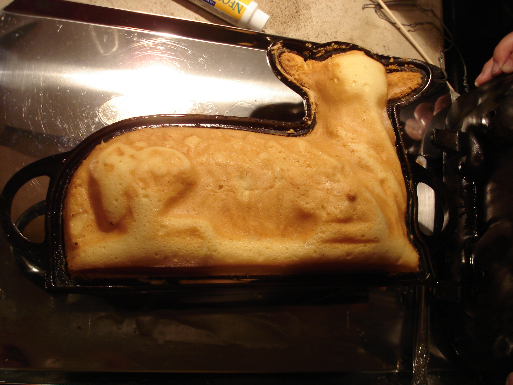
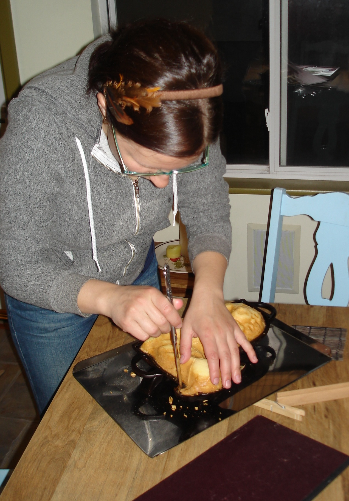
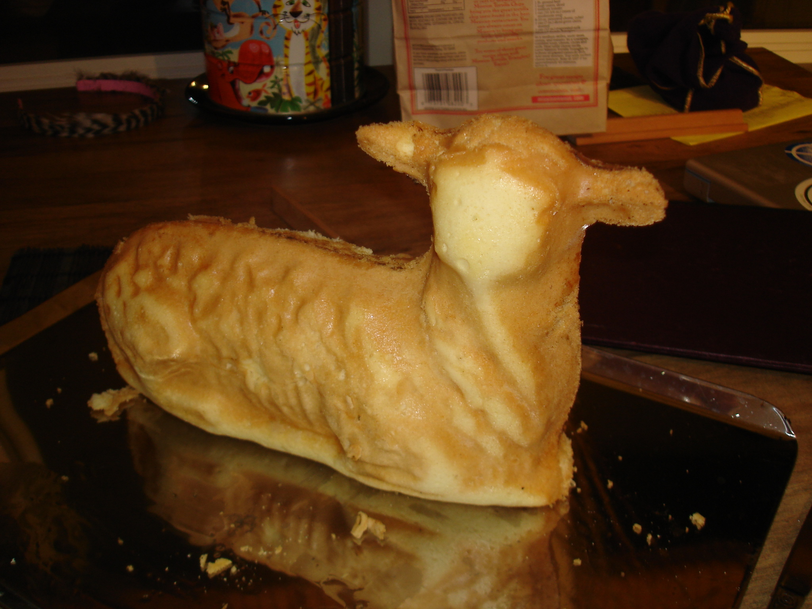
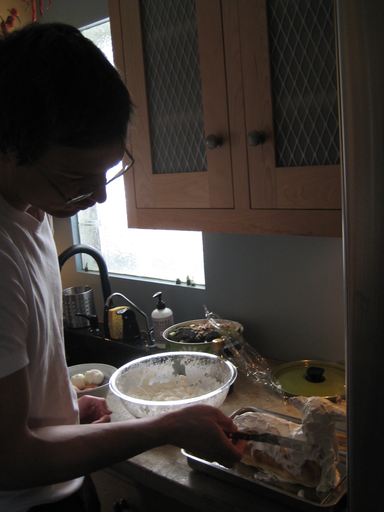
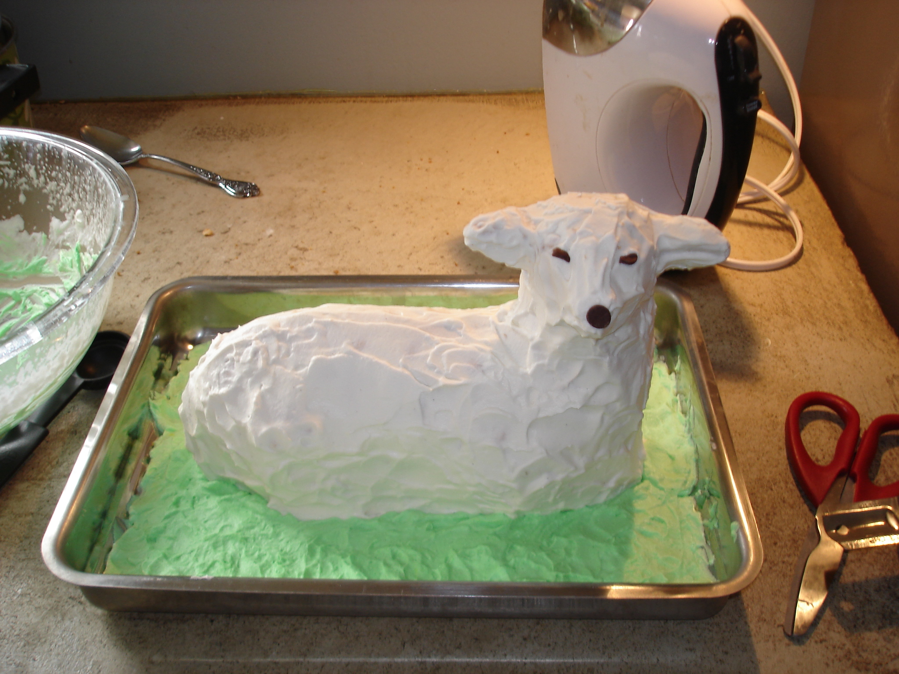
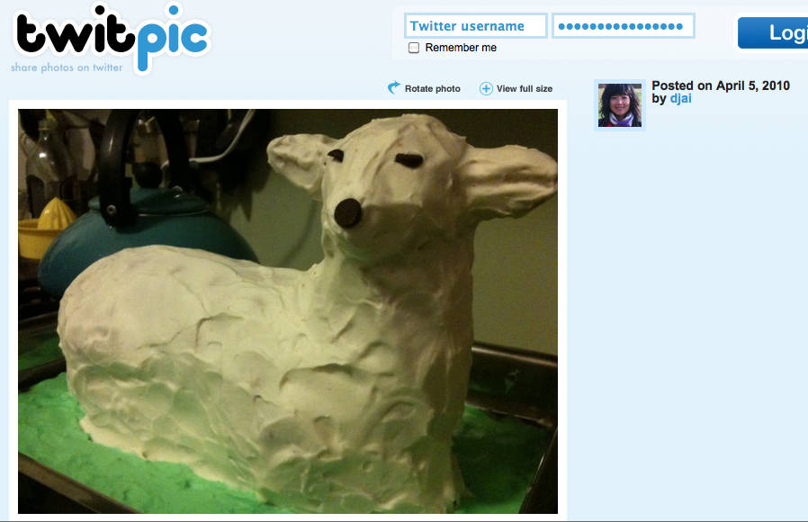

We followed the standard 16-oz "Pound Cake" instructions this year and things came out well. This time I smeared shortening into every nook and cranny and then heated the mold for 20 minutes at 375. Then I let it cool completely and poured in the batter. I tried to pile more batter into the head part but the the nose still came out partially empty.

Louisa is some kind of lamb cake mold extraction genius. There was barely anything left in the mold and the delicate ears didn't need toothpicks at all. (I still put in toothpicks so I wouldn't break them in the frosting process.)

Lauren whipped up a super-stabilized whip cream frosting that again had the gumption to reconstruct a lamby nose.

The lamb cake would probably be okay to eat but it always has a way of sticking around. After we abandoned it fully intact at our second easter-day party, the hostess felt guilty enough to snap a photo before they dumped it.

