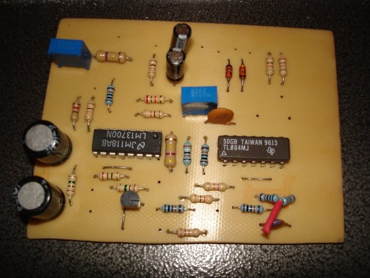
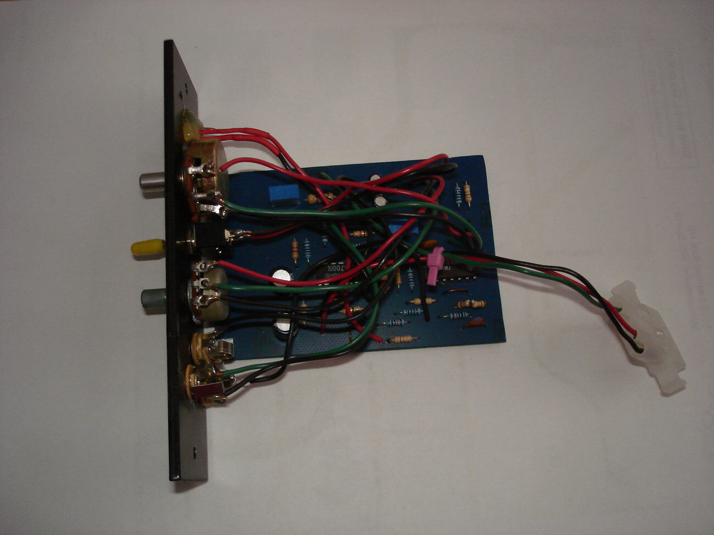
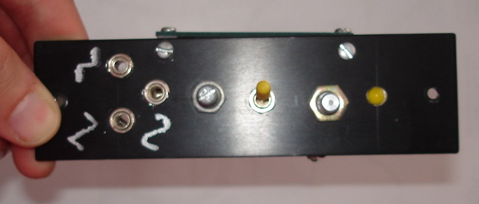

I built a couple of these since they are simple and pretty useful. I've been kind of disappointed as the frequency range gets worse and worse over time. Still usable tho. [Plans](http://www.musicfromouterspace.com/analogsynth/coolnewlfo.html) . 

 

 

 