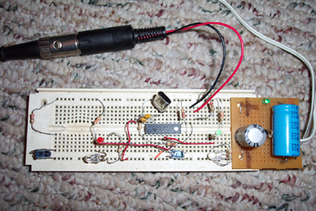
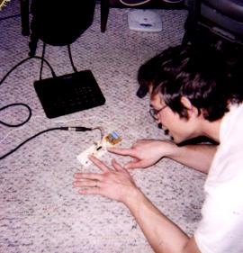

 

Since I was like 10, I wanted to make a midi drum pad with infra-red light beams to break instead of pads to hit. Now I've been working with PIC16f84 chips and realized I could do it pretty easily.

This prototype had two light-pads that sent midi successfully.

The next step will be to make one with 8 pads and build a usable model to see if that's enough or if I want to multiplex and have 16 or more pads.
