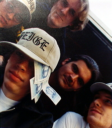

Beige got to head to Munich right after 9-11 for a high-tech art show and performance. 

 

Beige got to head to Munich right after 9-11 for a high-tech art show and performance. We love to hang out with Bodenstaendig 2000 and Olia Lialina and had a great time showing our stuff and talking smack. 

[Beige Interview](http://www.makeworlds.org/1/interview_beige.html) 

I'll never be able to thank Olia enough for putting us up a few extra days. And I'll never be able to forgive her for feeding us that much [weisswurst](http://en.wikipedia.org/wiki/Weisswurst) and then telling us it was made of brains at the height of the mad cow crisis. 