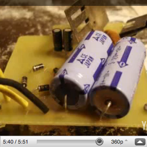

 

I've made a lot of kludged-together power supplies in my time, but they scare me. So I drew this PCB pattern, scanned it in, and it has been working well for me: 

 

Here is my lengthy PCB process: 

<embed src="http://www.youtube.com/v/AlNU8zuCVqw&amp;hl=en&amp;fs=1" type="application/x-shockwave-flash" allowscriptaccess="always" allowfullscreen="true" width="425" height="344"> 