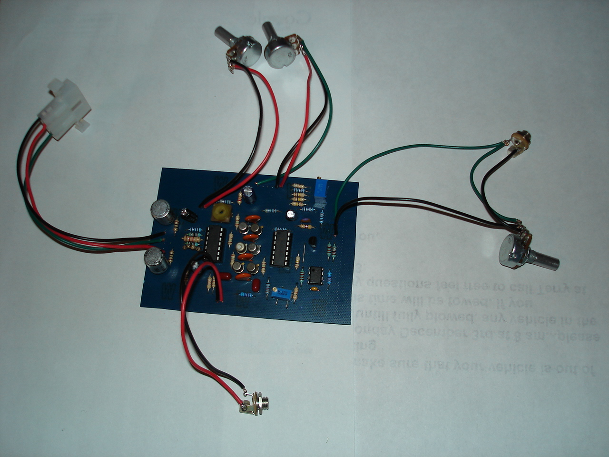
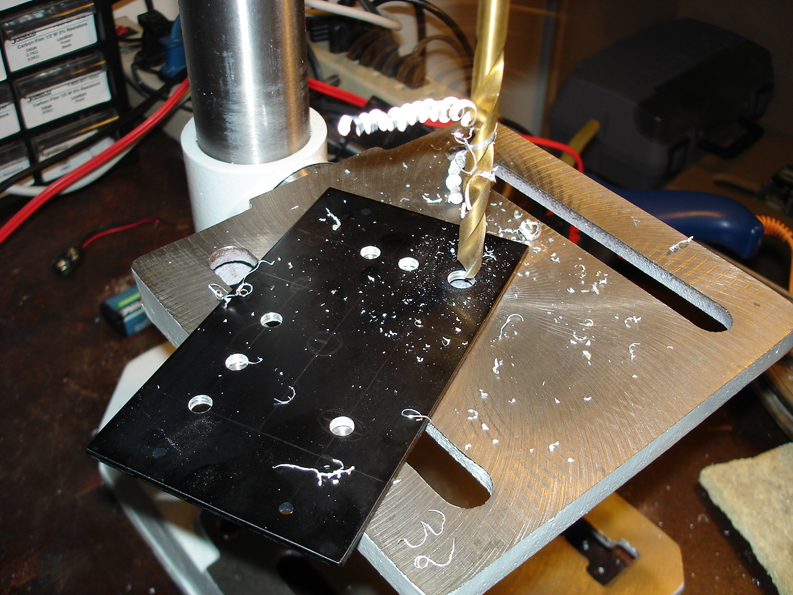
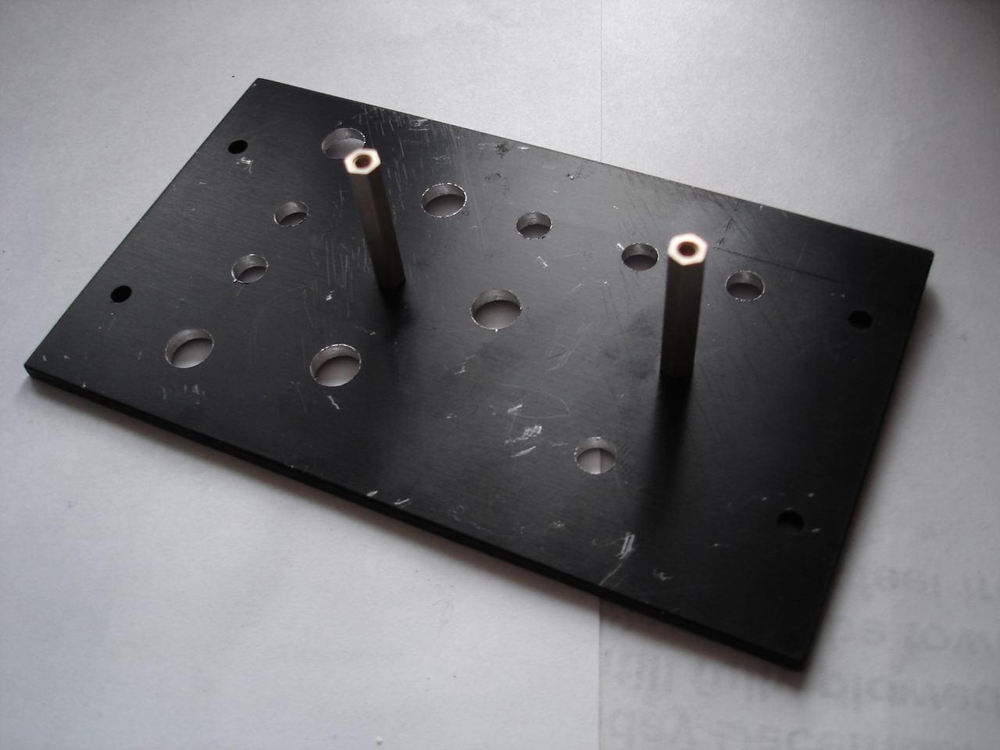
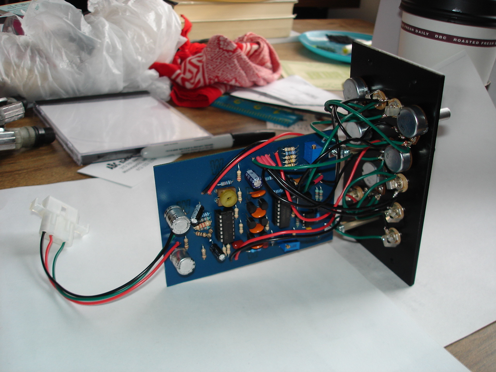

This is a pretty classy Moog style VCF I found plans for [here](http://yusynth.net/Modular/EN/MOOGVCF/index.html) . I got help troubleshooting my construction from the nice people on the forums at [electro-music.com](http://electro-music.com/) , including Yves Usson himself.

<audio src="minimoog_sample.mp3" controls="controls" preload="auto" autobuffer="autobuffer" xmlns="http://www.w3.org/1999/xhtml"><source src="minimoog_sample.mp3"></audio>
