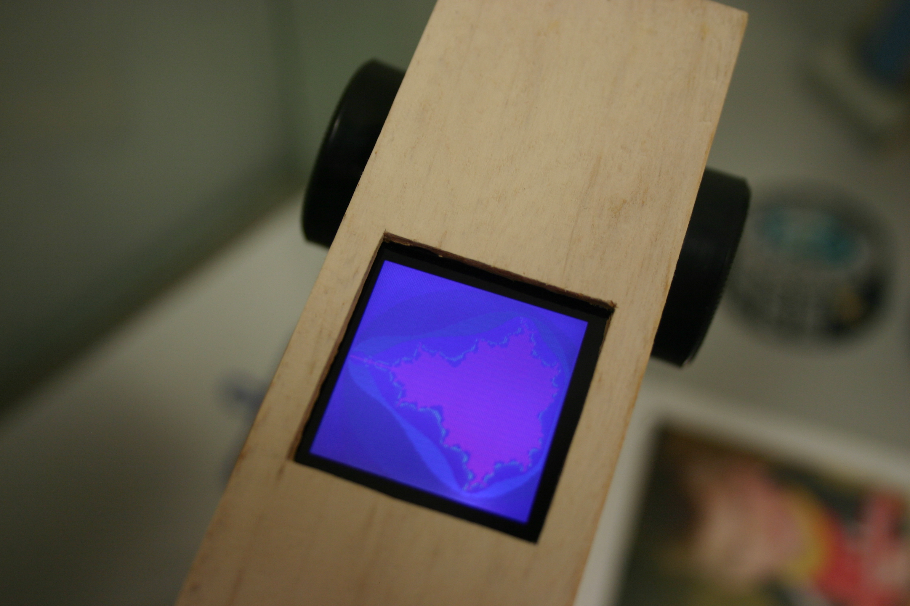

 

This code draws a Mandelbrot pattern on the 132x132 Nokia 6100 type screen with Epson controller (will not work for the Phillips) from an [Arduino](http://arduino.cc). I started with the code example from [this post](http://www.arduino.cc/cgi-bin/yabb2/YaBB.pl?num=1237036119/45) and made some optimizations- especially to the serial communication code. Then I ported the Mandelbrot algorithm from [here](http://www.codeproject.com/KB/cpp/mandelbrot_obfuscation.aspx). The zoom level and viewport into the fractal can easily be changed or made to update each loop. But it's slow.

[source](undefined)

To send serial data a bit faster, one might reserve an entire Arduino port and rotate/clock, rotate/clock and so on, instead of repeatedly testing the data byte and flipping a single pin. I still haven't been able to engage the 8-bit color mode, which would again speed things up since I could send one byte per pixel instead of three bytes for two pixels. I used an 8Mhz and would only use 16Mhz or higher setup if I did this again. When will there be a 2Ghz Arduino? Then it might look more like this:

swfobject.embedSWF("/joe/wp-content/uploads/2009/09/mandelbrotset.swf", "mandelbrot", "132", "132", "10.0.0");

(needs flash)

(mouse left/right for pan, up/down for zoom) 14 
  <!---
  

      
    

            

                            

        

 
 
This code draws a Mandelbrot pattern on the 132x132 Nokia 6100 type screen with Epson controller (will not work for the Phillips) from an <a href="http://arduino.cc">Arduino</a>.  I started with the code example from <a href="http://www.arduino.cc/cgi-bin/yabb2/YaBB.pl?num=1237036119/45">this post</a> and made some optimizations- especially to the serial communication code. Then I ported the Mandelbrot algorithm from <a href="http://www.codeproject.com/KB/cpp/mandelbrot_obfuscation.aspx">here</a>. The zoom level and viewport into the fractal can easily be changed or made to update each loop.  But it's slow.
 

  

 
<a href="http://www.beigerecords.com/joe/wp-content/uploads/2009/09/mandelbrot_zoomer.pde">source</a>
 

 
To send serial data a bit faster, one might reserve an entire Arduino port and rotate/clock, rotate/clock and so on, instead of repeatedly testing the data byte and flipping a single pin. I still haven't been able to engage the 8-bit color mode, which would again speed things up since I could send one byte per pixel instead of three bytes for two pixels.  I used an 8Mhz and would only use 16Mhz or higher setup if I did this again.  When will there be a 2Ghz Arduino?  Then it might look more like this:
 

  
 
(needs flash)
 
(mouse left/right for pan, up/down for zoom)

 14
  --->