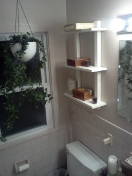
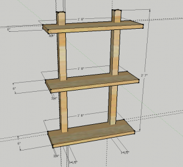
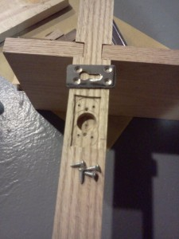
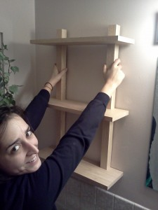

 

Lauren asked me to copy a shelf seen at West Elm for our bathroom.  I fabricated the five pieces of oak and made this type of steel hanger to be self-contained and keep close to the wall.  A happy customer   9 
  <!---
  

      
    

            

                            

        

 
Lauren asked me to copy a shelf seen at West Elm for our bathroom.

  

I fabricated the five pieces of oak and made this type of steel hanger to be self-contained and keep close to the wall.

  

A happy customer

  

  9
  --->