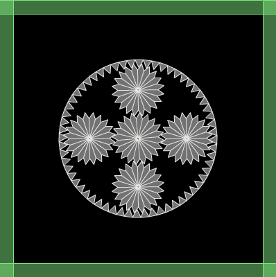

 

All the [Box2D](http://box2dflash.sourceforge.net/) documentation says to use the automatic gear joint and not to mess with simulating gears this way ...so it had to be done! A little trigonometry and fidgeting with sizes produced this simple planetary set:

<!-- swfobject.embedSWF("http://www.beigerecords.com/joe/sites/default/files/plexpinballmodule.swf", "planetary", "400", "400", "9.0.0"); // -->

I quickly modified my sprocket construction code to make the annulus and spent a while scratching my head before remembering that the shape vertices have to be defined clockwise. Once they were, everything was interacting. But in all honesty, I have to nudge the annulus to get it going no matter how much torque I apply to the sun gear. It would be great to understand why if you know. And it would be really cool to develop an "eccentric drive" or two like these:

  

<embed src="http://www.youtube.com/v/QP5LN9jcsz4&amp;hl=en&amp;fs=1&amp;" type="application/x-shockwave-flash" allowscriptaccess="always" allowfullscreen="true" width="425" height="344">  
<embed src="http://www.youtube.com/v/8dR38uQN74c&amp;hl=en&amp;fs=1&amp;" type="application/x-shockwave-flash" allowscriptaccess="always" allowfullscreen="true" width="425" height="344">  
and eventually...  
<embed src="http://www.youtube.com/v/pHO1JTNPPOU&amp;hl=en&amp;fs=1&amp;" type="application/x-shockwave-flash" allowscriptaccess="always" allowfullscreen="true" width="560" height="340">

9 
  <!---
  

      
    

            

                            

        

 
 
All the <a href="http://box2dflash.sourceforge.net/">Box2D</a> documentation says to use the automatic gear joint and not to mess with simulating gears this way ...so it had to be done! A little trigonometry and fidgeting with sizes produced this simple planetary set:
 

 
I quickly modified my sprocket construction code to make the annulus and spent a while scratching my head before remembering that the shape vertices have to be defined clockwise.  Once they were, everything was interacting.  But in all honesty, I have to nudge the annulus to get it going no matter how much torque I apply to the sun gear.  It would be great to understand why if you know.  And it would be really cool to develop an "eccentric drive" or two like these:
 
   

 

<object width="425" height="344"><param name="movie" value="http://www.youtube.com/v/QP5LN9jcsz4&amp;hl=en&amp;fs=1&amp;"></param><param name="allowFullScreen" value="true"></param><param name="allowscriptaccess" value="always"></param><embed src="http://www.youtube.com/v/QP5LN9jcsz4&amp;hl=en&amp;fs=1&amp;" type="application/x-shockwave-flash" allowscriptaccess="always" allowfullscreen="true" width="425" height="344"></embed></object>
 
<object width="425" height="344"><param name="movie" value="http://www.youtube.com/v/8dR38uQN74c&amp;hl=en&amp;fs=1&amp;"></param><param name="allowFullScreen" value="true"></param><param name="allowscriptaccess" value="always"></param><embed src="http://www.youtube.com/v/8dR38uQN74c&amp;hl=en&amp;fs=1&amp;" type="application/x-shockwave-flash" allowscriptaccess="always" allowfullscreen="true" width="425" height="344"></embed></object>
 
and eventually...
 
<object width="560" height="340"><param name="movie" value="http://www.youtube.com/v/pHO1JTNPPOU&amp;hl=en&amp;fs=1&amp;"></param><param name="allowFullScreen" value="true"></param><param name="allowscriptaccess" value="always"></param><embed src="http://www.youtube.com/v/pHO1JTNPPOU&amp;hl=en&amp;fs=1&amp;" type="application/x-shockwave-flash" allowscriptaccess="always" allowfullscreen="true" width="560" height="340"></embed></object>

 9
  --->