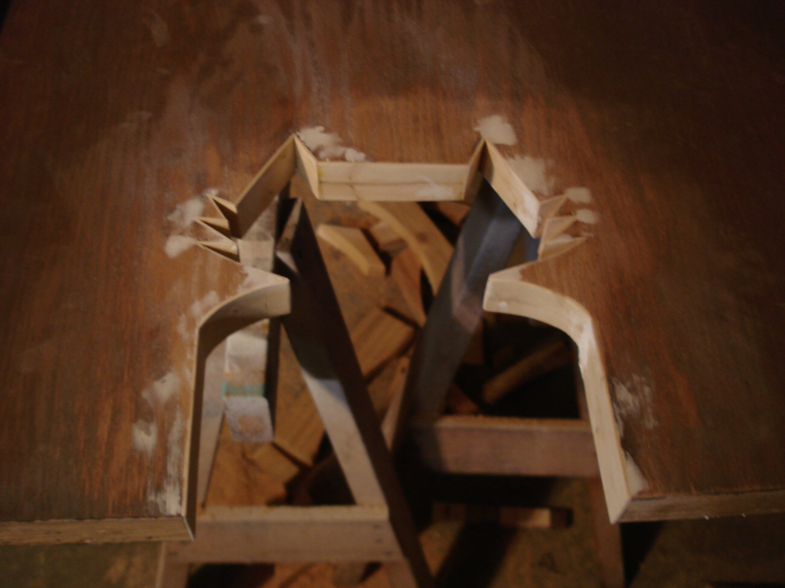
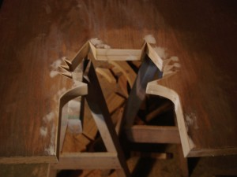
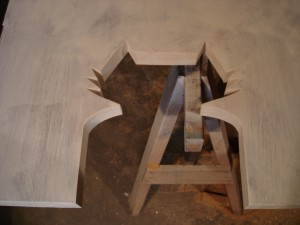
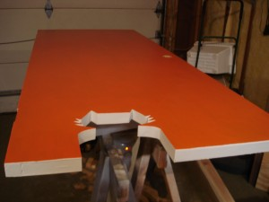
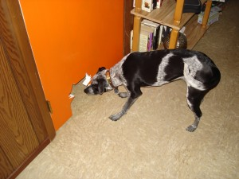
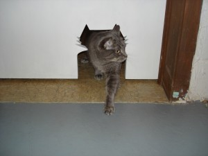

 

The door between basement ping pong room and basement laundry/toilet room needed to allow for cats' access to the litter box. Lauren had the perfect idea: we would make a cat-shaped hole that would allow cats but no dog through. Mitch Loidolt kindly drew for us a feline outline.

Some thin slices of scrap wood spanned the cutout.

wood filler / sanding / repeat

primer

paint

Not a chance for Clementine.

Gatsby has a safe zone now.

<!--//--><!\[CDATA\[//><!-- var \_gaq = \_gaq || \[\];\_gaq.push(\["\_setAccount", "UA-6502690-3"\]);\_gaq.push(\["\_trackPageview"\]);(function() {var ga = document.createElement("script");ga.type = "text/javascript";ga.async = true;ga.src = ("https:" == document.location.protocol ? "https://ssl" : "http://www") + ".google-analytics.com/ga.js";var s = document.getElementsByTagName("script")\[0\];s.parentNode.insertBefore(ga, s);})(); //--><!\]\]>

3 
  <!---
  

      
    

            

                            

        

 
 
The door between basement ping pong room and basement laundry/toilet room needed to allow for cats' access to the litter box. Lauren had the perfect idea: we would make a cat-shaped hole that would allow cats but no dog through. Mitch Loidolt kindly drew for us a feline outline.

Some thin slices of scrap wood spanned the cutout.

wood filler / sanding / repeat

primer

paint

Not a chance for Clementine.

Gatsby has a safe zone now.

          
    
          
    
  
 <!-- /node -->          								
         <!-- /main-content -->

        
       <!-- /content-column -->

               <!-- /sidebar-left -->
      
               <!-- /sidebar-right -->
          
   <!-- /columns -->

    
           <!-- /footer-wraper -->
    
   <!-- /container -->

  

 3
  --->