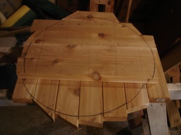
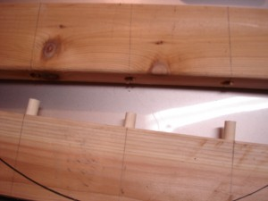
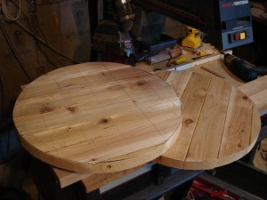
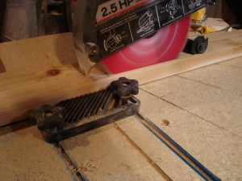
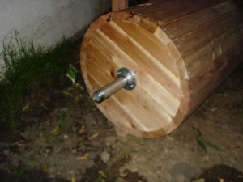
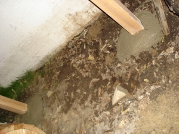
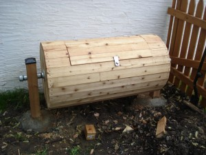

 

We accumulated a lot of compost quickly since moving into our house and it's become time to do something about it. This unwieldy barrel got designed on the fly but I think it will work. circle traced from inverted trash can  end parts joined with dowels   modified radial saw for increased ripping safety. twenty-four 4" lengths of 2x4 got beveled to eight degrees on each side.  these 1-1/2in. sections of pipe and fittings seem perfect for the axels  stationary supports  lifting and simultaneously aligning the axels was not easy. turning this behemoth is also not easy. it will need handles around one end.  16 
  <!---
  

      
    

            

                            

        

 
We accumulated a lot of compost quickly since moving into our house and it's become time to do something about it. This unwieldy barrel got designed on the fly but I think it will work.

circle traced from inverted trash can

  

end parts joined with dowels

  

  

modified radial saw for increased ripping safety. twenty-four 4" lengths of 2x4 got beveled to eight degrees on each side.

  

these 1-1/2in. sections of pipe and fittings seem perfect for the axels

  

stationary supports

  

lifting and simultaneously aligning the axels was not easy. turning this behemoth is also not easy. it will need handles around one end.

  
 16
  --->