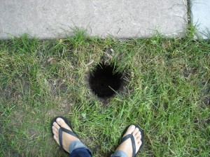

 

Our house had fence on two sides and we needed to complete the circuit to keep in puppy.  The hardest part was getting started. [<!\[CDATA\[//><!-- var \_gaq = \_gaq || \[\];\_gaq.push(\["\_setAccount", "UA-6502690-3"\]);\_gaq.push(\["\_trackPageview"\]);(function() {var ga = document.createElement("script");ga.type = "text/javascript";ga.async = true;ga.src = ("https:" == document.location.protocol ? "https://ssl" : "http://www") + ".google-analytics.com/ga.js";var s = document.getElementsByTagName("script")\[0\];s.parentNode.insertBefore(ga, s);})(); //--><!\]\]>  5 
  <!---
  

      
    

            

                            

        

 
Our house had fence on two sides and we needed to complete the circuit to keep in puppy.

  
The hardest part was getting started.

 <a href="http://www.beigerecords.com/joe/wp-content/uploads/2009/09/3_stringers1.jpg" xmlns="http://www.w3.org/1999/xhtml">&lt;img src="http://www.beigerecords.com/joe/wp-content/uploads/2009/09/3_stringers1-225x300.jpg" alt="3_stringOur house had fence on two sides and we needed to complete the circuit to keep in puppy.

The hardest part was getting started.

Simple design stolen from the neighbor's fence.

A few measurements and...

...tons of pickets to cut.

The back gate touched on the side at first, but a quick ratcheting and extra brace put it right.

The front!

The back latch works great.

The back!

All finished up with copper toppers and some Behr semi-transparent deck and fence stain.  I read the reviews of this stuff too late -- evidently it's terrible.  Luckily we only put on one coat but it's way more orange than the picture on the can (or here) would have you believe.  Next time we'll read up first and test on a scrap.

          
    
          
    
  
 <!-- /node -->          								
         <!-- /main-content -->

        
       <!-- /content-column -->

               <!-- /sidebar-left -->
      
               <!-- /sidebar-right -->
          
   <!-- /columns -->

    
           <!-- /footer-wraper -->
    
   <!-- /container -->

  

</a> 5
  --->