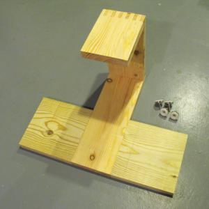
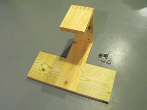
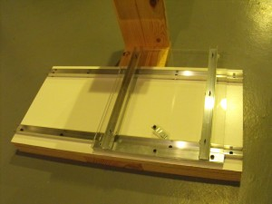
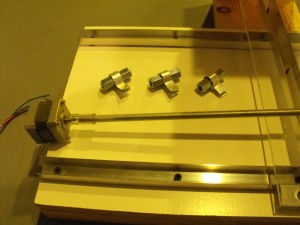

 

I started building a CNC mill this weekend using a lot of the ideas from Tom McWire's popular instructible: [http://www.instructables.com/id/Easy-to-Build-Desk-Top-3-Axis-CNC-Milling-Machine/](http://www.instructables.com/id/Easy-to-Build-Desk-Top-3-Axis-CNC-Milling-Machine/)  ThI started building a CNC mill this weekend using a lot of the ideas from Tom McWire's popular instructible: [http://www.instructables.com/id/Easy-to-Build-Desk-Top-3-Axis-CNC-Milling-Machine/](http://www.instructables.com/id/Easy-to-Build-Desk-Top-3-Axis-CNC-Milling-Machine/)  The z-axis support is 6" x 1.25" lumber that is box jointed. This is an extremely rigid assembly. The leveling feet probably aren't necessary but they were 35 cents at [Ax-man](http://ax-man.com/) and a bit classy.  Here is my acrylic x-axis with aluminum channels, built on a piece of MDF. Menards didn't have ball bearings of the correct size so I'm trying a small, nylon shower curtain roller that is handily threaded. It turns easily with very little play and I can't imagine much difference between this and a ball bearing for this application.  Here are aluminum-wrapped coupling nuts for the three axes. Using long couplers instead of shorter tee-nuts is a great idea from the Tom. Also a great idea is using tubing to connect the stepper motor shaft to the threaded rod. I've been looking for a good way to make that joint for a while now and this is perfect. 16 
  <!---
  

      
    

            

                            

        

 
I started building a CNC mill this weekend using a lot of the ideas from Tom McWire's popular instructible:  <a href="http://www.instructables.com/id/Easy-to-Build-Desk-Top-3-Axis-CNC-Milling-Machine/" xmlns="http://www.w3.org/1999/xhtml">http://www.instructables.com/id/Easy-to-Build-Desk-Top-3-Axis-CNC-Milling-Machine/</a> 

  

ThI started building a CNC mill this weekend using a lot of the ideas from Tom McWire's popular instructible:  <a href="http://www.instructables.com/id/Easy-to-Build-Desk-Top-3-Axis-CNC-Milling-Machine/" xmlns="http://www.w3.org/1999/xhtml">http://www.instructables.com/id/Easy-to-Build-Desk-Top-3-Axis-CNC-Milling-Machine/</a> 

  

The z-axis support is 6" x 1.25" lumber that is box jointed. This is an extremely rigid assembly. The leveling feet probably aren't necessary but they were 35 cents at  <a href="http://ax-man.com/" xmlns="http://www.w3.org/1999/xhtml">Ax-man</a>  and a bit classy.

  

Here is my acrylic x-axis with aluminum channels, built on a piece of MDF. Menards didn't have ball bearings of the correct size so I'm trying a small, nylon shower curtain roller that is handily threaded. It turns easily with very little play and I can't imagine much difference between this and a ball bearing for this application.

  

Here are aluminum-wrapped coupling nuts for the three axes. Using long couplers instead of shorter tee-nuts is a great idea from the Tom. Also a great idea is using tubing to connect the stepper motor shaft to the threaded rod. I've been looking for a good way to make that joint for a while now and this is perfect. 16
  --->