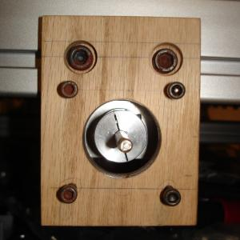

 

This oak motor mount corrects for the difference between metric extrusions in the base and standard bearing blocks and acme nut. Controller and motors on the way. 2 
  <!---
  

      
    

            

                            

        

 
This oak motor mount corrects for the difference between metric extrusions in the base and standard bearing blocks and acme nut. Controller and motors on the way. 2
  --->