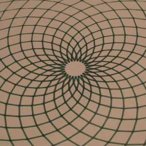

 

Motors installed and wired to controller / controller connected to PC. I jogged each axis end to and repeatedly to shift things into place, tightening a little each trip. Things are looking pretty well square after building a sharpie holder and jogging in large rectangles. Here is an old javascript/easelJS drawing pattern I made, now adapted to output g-code. Router mount on the way. For now, I have an overly powerful plotter / sharpie ruiner.

6 
  <!---
  

      
    

            

                            

        

 
 
Motors installed and wired to controller / controller connected to PC. I jogged each axis end to and repeatedly to shift things into place, tightening a little each trip. Things are looking pretty well square after building a sharpie holder and jogging in large rectangles. Here is an old javascript/easelJS drawing pattern I made, now adapted to output g-code. Router mount on the way. For now, I have an overly powerful plotter / sharpie ruiner.
 

 <iframe width="420" height="315" src="http://www.youtube.com/embed/fnF_Bmg9Ugo" frameborder="0" allowfullscreen="allowfullscreen" xmlns="http://www.w3.org/1999/xhtml"></iframe> 

 6
  --->