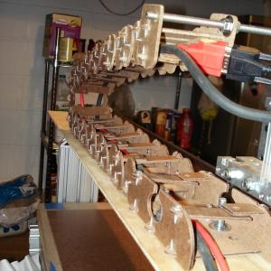
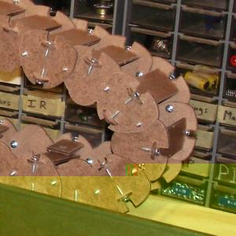
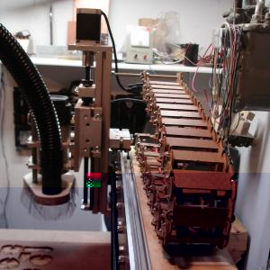

 

There is a great cable tray design shared online by Kronos Robotics at [http://www.kronosrobotics.com/krmx01/krmx01upgrades/dragoncable/](http://www.kronosrobotics.com/krmx01/krmx01upgrades/dragoncable/)

This made for a perfect "first cuts" project with my router. One learns a lot of things quickly in the first few hours operating a router like this. Work has to be held down very firmly to produce the shape accurately. And a cable tray like the Dragon is very necessary to keep cables safely away from the bit and from being stretched across parts of the machine.

6 
  <!---
  

      
    

            

                            

              

                            

              

                            

              

                            

        

 
 
There is a great cable tray design shared online by Kronos Robotics at <a href="http://www.kronosrobotics.com/krmx01/krmx01upgrades/dragoncable/">http://www.kronosrobotics.com/krmx01/krmx01upgrades/dragoncable/</a>
 

 
This made for a perfect "first cuts" project with my router. One learns a lot of things quickly in the first few hours operating a router like this. Work has to be held down very firmly to produce the shape accurately. And a cable tray like the Dragon is very necessary to keep cables safely away from the bit and from being stretched across parts of the machine.
 
 6
  --->