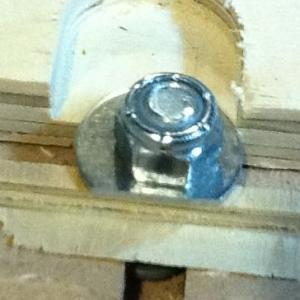

 

Here is cutting a little drawer that turned out great.

I inadvertently learned that this FLA-100 clone will cut steel when my 1/4" carbide tool path intersected one of the 5/16" washers I was using to hold down the work. At 60ipm there was an ugly chatter but no steps were skipped and the job completed perfectly. I'm pretty excited about trying some aluminum now.

7 
  <!---
  

      
    

            

                            

        

 
 
Here is cutting a little drawer that turned out great. 
 

 <iframe width="420" height="315" src="http://www.youtube.com/embed/6ZwIZr6VTXQ" frameborder="0" allowfullscreen="allowfullscreen" xmlns="http://www.w3.org/1999/xhtml"></iframe> 

 
I inadvertently learned that this FLA-100 clone will cut steel when my 1/4" carbide tool path intersected one of the 5/16" washers I was using to hold down the work. At 60ipm there was an ugly chatter but no steps were skipped and the job completed perfectly. I'm pretty excited about trying some aluminum now.
 7
  --->