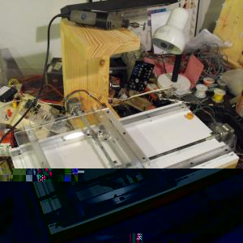
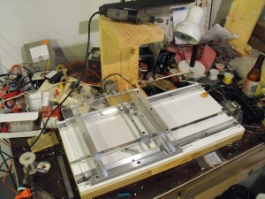
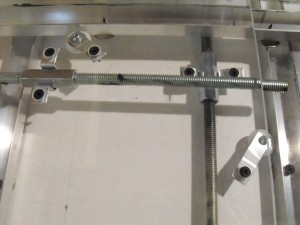
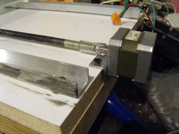

 

 The base with Z-axis trunk and leveling feet are all together.  The base with Z-axis trunk and leveling feet are all together. X and Y axes are built with motors mounted and sliding parts greased.  My platform is larger than the one in the [original plan](http://www.instructables.com/id/Easy-to-Build-Desk-Top-3-Axis-CNC-Milling-Machine/) and so I used 3/8" rods and coupling nuts instead of 1/4". That makes the coupling nuts hang lower under the platforms. They were scraping the bottom before I installed extra washers under the rails for spacing and unfolded the aluminum brackets so they just go around the nuts one time instead of two.  The motor mounts are dremeled and drilled from a length of angle steel. 12 
  <!---
  

      
    

            

                            

        

 
  

The base with Z-axis trunk and leveling feet are all together.  

The base with Z-axis trunk and leveling feet are all together. X and Y axes are built with motors mounted and sliding parts greased.

  

My platform is larger than the one in the  <a href="http://www.instructables.com/id/Easy-to-Build-Desk-Top-3-Axis-CNC-Milling-Machine/" xmlns="http://www.w3.org/1999/xhtml">original plan</a>  and so I used 3/8" rods and coupling nuts instead of 1/4". That makes the coupling nuts hang lower under the platforms. They were scraping the bottom before I installed extra washers under the rails for spacing and unfolded the aluminum brackets so they just go around the nuts one time instead of two.

  

The motor mounts are dremeled and drilled from a length of angle steel. 12
  --->