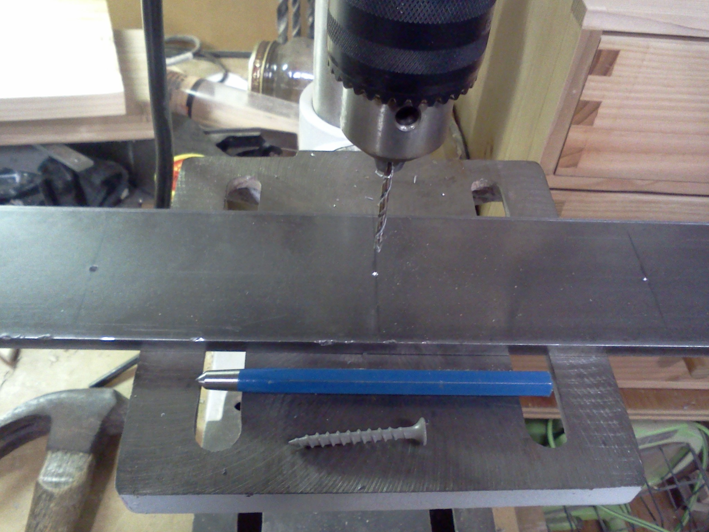
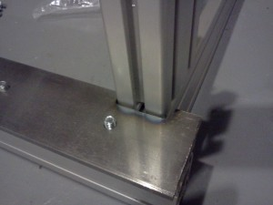
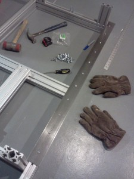

 

[DiscountSteel.com](http://discountsteel.com) had my rails cut and ready within 24 hours and I picked them up at lunch. Carefully scratched 32.7mm from the good edge with a woodscrew about every 4in. Then a tap with the transfer punch, check, and a good hit with the transfer punch. I drilled 1/8" pilot holes and then 21/64" for a close fit on the 5/16" carriage bolts.  My rails are 2-1/2" and hang inside a little. 20 minutes on the grinder per notch.  They fit! This feels like real progress. The base is square and tight and the last metric vs. standard issue to correct will be the X-axis motor mount. Everything else (bearing blocks, acme nut) is referenced from the bottom surface of the 8020. I added a sideways length of my 40x80mm 80/20 between the front table side and the 14" extension so that the front 1-1/2" separated bearing block holes will fit. I sacrifice the lengthwise adjustment for that but can work out that difference with the grinder. All X and Y-aligned pieces will be a few millimeters longer than the plan due to the difference between 80mm and 3in.  10 
  <!---
  

      
    

            

                            

        

 
 <a href="http://discountsteel.com" xmlns="http://www.w3.org/1999/xhtml">DiscountSteel.com</a>  had my rails cut and ready within 24 hours and I picked them up at lunch. Carefully scratched 32.7mm from the good edge with a woodscrew about every 4in. Then a tap with the transfer punch, check, and a good hit with the transfer punch. I drilled 1/8" pilot holes and then 21/64" for a close fit on the 5/16" carriage bolts.

  

My rails are 2-1/2" and hang inside a little. 20 minutes on the grinder per notch.

  

They fit! This feels like real progress. The base is square and tight and the last metric vs. standard issue to correct will be the X-axis motor mount. Everything else (bearing blocks, acme nut) is referenced from the bottom surface of the 8020. I added a sideways length of my 40x80mm 80/20 between the front table side and the 14" extension so that the front 1-1/2" separated bearing block holes will fit. I sacrifice the lengthwise adjustment for that but can work out that difference with the grinder. All X and Y-aligned pieces will be a few millimeters longer than the plan due to the difference between 80mm and 3in.

  
 10
  --->