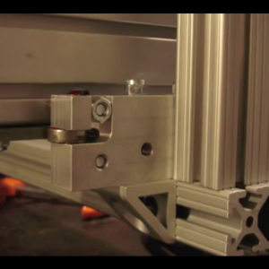

 

The rest of my 80/20 arrived at John Henry Foster and I picked it up. The X-axis is aligned and slides easily and smoothly by hand. So I tightened down the acme nut and bearing blocks at each end and chucked an inch of 1/4" rod in my drill to try it out. Really difficult to not put the remaining parts and electronics on credit cards now. 4 
  <!---
  

      
    

            

                            

        

 
The rest of my 80/20 arrived at John Henry Foster and I picked it up. The X-axis is aligned and slides easily and smoothly by hand. So I tightened down the acme nut and bearing blocks at each end and chucked an inch of 1/4" rod in my drill to try it out. Really difficult to not put the remaining parts and electronics on credit cards now.

 <iframe width="560" height="349" src="http://www.youtube.com/embed/qUawRx7x16Q" frameborder="0" allowfullscreen="allowfullscreen" xmlns="http://www.w3.org/1999/xhtml"></iframe> 

 4
  --->