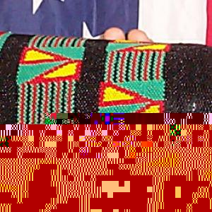
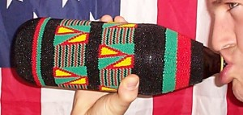

 

 **substrate: ** Miller Brewing Company 40oz brown glass bottle **cover:** size 11 seed beads peyote stitched on black size d nylon thread **kente cloth pattern:** adwinasa - literally means "all motifs are used up." the cloth was viewed as one of the top quality, and the most prestigiou  **substrate: ** Miller Brewing Company 40oz brown glass bottle **cover:** size 11 seed beads peyote stitched on black size d nylon thread **kente cloth pattern:** adwinasa - literally means "all motifs are used up." the cloth was viewed as one of the top quality, and the most prestigious of kente cloths, besides those woven exclusively for Asante kings. it was in the past, worn by kings and people of high status and wealth. **beadcount:** 22352 (estimated by weight) **model:** Doug Keeney 22 
  <!---
  

      
    

            

                            

        

 
  

 <strong xmlns="http://www.w3.org/1999/xhtml">substrate: </strong> Miller Brewing Company 40oz brown glass bottle

 <strong xmlns="http://www.w3.org/1999/xhtml">cover:</strong>  size 11 seed beads peyote stitched on black size d nylon thread

 <strong xmlns="http://www.w3.org/1999/xhtml">kente cloth pattern:</strong>  adwinasa - literally means "all motifs are used up."  the cloth was viewed as one of the top quality, and the most prestigiou  

 <strong xmlns="http://www.w3.org/1999/xhtml">substrate: </strong> Miller Brewing Company 40oz brown glass bottle

 <strong xmlns="http://www.w3.org/1999/xhtml">cover:</strong>  size 11 seed beads peyote stitched on black size d nylon thread

 <strong xmlns="http://www.w3.org/1999/xhtml">kente cloth pattern:</strong>  adwinasa - literally means "all motifs are used up."  the cloth was viewed as one of the top quality, and the most prestigious of kente cloths, besides those woven exclusively for Asante kings. it was in the past, worn by kings and people of high status and wealth.

 <strong xmlns="http://www.w3.org/1999/xhtml">beadcount:</strong>  22352 (estimated by weight)

 <strong xmlns="http://www.w3.org/1999/xhtml">model:</strong>  Doug Keeney

 22
  --->