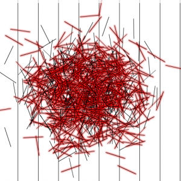

 

There is an interesting way to calculate PI with random probability called Count Buffon's Needle. The way it's done is to draw parallel lines on a large sheet of paper that are equidistant from each other. Then one would drop needles of exactly that length (the distance between lines) and count both the overall number of needles and the number of needles that intersect the lines on the paper after they settle. The probability of a needle intersecting a line works out to be 2/&pi;. So, 2 times the number of needles divided by the number of intersections gives an approximation of &pi; that gets better as we drop more needles.

<!-- swfobject.embedSWF("http://www.beigerecords.com/joe/sites/default/files/countbuffonsneedle1.swf", "pi", "640", "640", "9.0.0"); // -->

7 
  <!---
  

      
    

            

                            

        

 
 
There is an interesting way to calculate PI with random probability called Count Buffon's Needle.  The way it's done is to draw parallel lines on a large sheet of paper that are equidistant from each other.  Then one would drop needles of exactly that length (the distance between lines) and count both the overall number of needles and the number of needles that intersect the lines on the paper after they settle.  The probability of a needle intersecting a line works out to be 2/&amp;pi;.  So, 2 times the number of needles divided by the number of intersections gives an approximation of &amp;pi; that gets better as we drop more needles.
 

  
 

 7
  --->