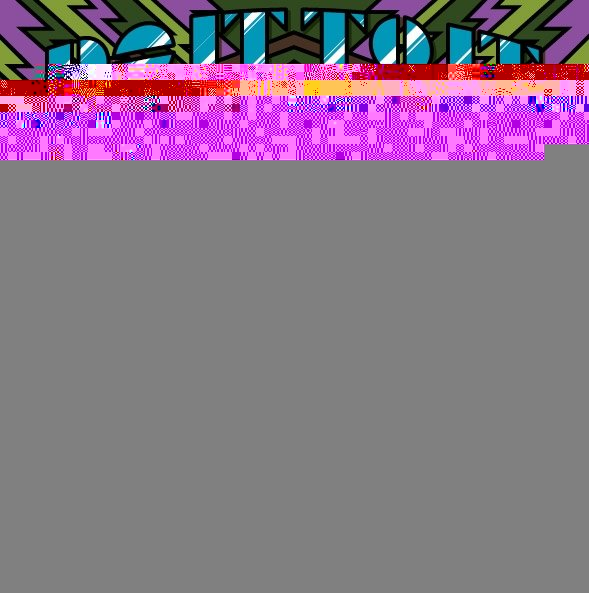
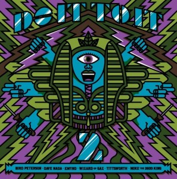

 

 I as "Wizard of Gaz" am very lucky to be getting on this record with the top names in cool club music and sincerely fancy packaging from, who else? Mike 2600 / BURLESQUE 4 
  <!---
  

      
    

            

                            

        

 
  
I as "Wizard of Gaz" am very lucky to be getting on this record with the top names in cool club music and sincerely fancy packaging from, who else? Mike 2600 / BURLESQUE 4
  --->