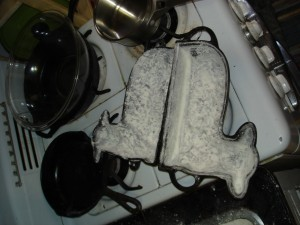
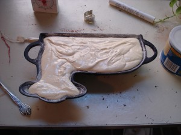
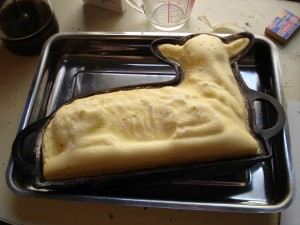
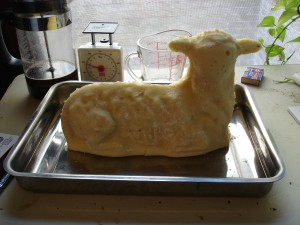
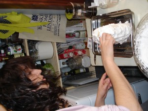
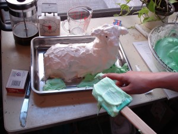
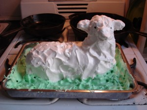

 

Grandma Beuckman made a lamb cake every Easter growing up, so I laughed a bit when Lauren's mom produced their iron lamb cake mold. She gave it to Lauren (wizard of desserts) to try this year and I think we restarted their tradition today. An attempt yesterday afternoon failed miserably so I decided to document today's go in case we got it right. And we did, somewhat. \[caption id="attachment\_304" align="alignnone" width="300" caption="All criscoed up and floured"\]  \[/caption\] \[caption id="attachment\_300" align="alignnone" width="300" caption="Batter up."\]  \[/caption\] \[caption id="attachment\_306" align="alignnone" width="300" caption="No face? More batter in the head next year..."\]  \[/caption\] \[caption id="attachment\_305" align="alignnone" width="300" caption="We decided the outside of the mold looks more like a lamb. The inside shape is creepy. But it stands!"\]  \[/caption\] \[caption id="attachment\_302" align="alignnone" width="300" caption="7-minute frosting was difficult to control but light enough not to pose much risk of further damage to the lambage and also great for the facial reconstructive surgery."\]  \[/caption\] \[caption id="attachment\_301" align="alignnone" width="300" caption="Careful not to get green on the white!"\]  \[/caption\] \[caption id="attachment\_303" align="alignnone" width="300" caption="Baaa"\]  \[/caption\] 16 
  <!---
  

      
    

            

                            

        

 
Grandma Beuckman made a lamb cake every Easter growing up, so I laughed a bit when Lauren's mom produced their iron lamb cake mold.  She gave it to Lauren (wizard of desserts) to try this year and I think we restarted their tradition today.  An attempt yesterday afternoon failed miserably so I decided to document today's go in case we got it right.  And we did, somewhat.

[caption id="attachment_304" align="alignnone" width="300" caption="All criscoed up and floured"]  [/caption]

[caption id="attachment_300" align="alignnone" width="300" caption="Batter up."]  [/caption]

[caption id="attachment_306" align="alignnone" width="300" caption="No face?  More batter in the head next year..."]  [/caption]

[caption id="attachment_305" align="alignnone" width="300" caption="We decided the outside of the mold looks more like a lamb.  The inside shape is creepy.  But it stands!"]  [/caption]

[caption id="attachment_302" align="alignnone" width="300" caption="7-minute frosting was difficult to control but light enough not to pose much risk of further damage to the lambage and also great for the facial reconstructive surgery."]  [/caption]

[caption id="attachment_301" align="alignnone" width="300" caption="Careful not to get green on the white!"]  [/caption]

[caption id="attachment_303" align="alignnone" width="300" caption="Baaa"]  [/caption]

 16
  --->