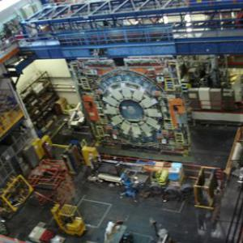
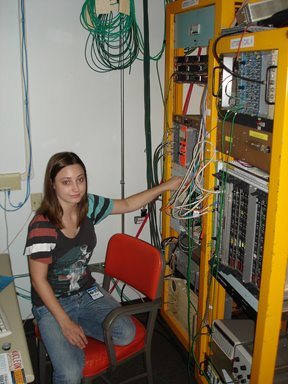
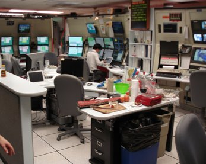

 

  
  
I took a huge road trip last week to visit friends and DJ a couple nights in eastern towns. One of my most anticipated stops was in Geneva, IL where my old classmate, Britney [Rutherford](http://en.wikipedia.org/wiki/Ernest_Rutherford) , gave me a tour of her lab at [Fermi National Accelerator Laboratory](http://en.wikipedia.org/wiki/Fermilab) . Yes - that's the place where they smash protons and anti-protons together at an energy of about two TRILLION electron-volts and look at what comes out of the collision.  
  

  
  
Britney works with photon-tube detectors connected via optical fibers to scintillating materials deep within the 5000-ton [CDF](http://www-cdf.fnal.gov/virtualtour/) on a layer of the detector called "Shower Max". Her test stand is a complete working version of a tiny part of that layer.  
  
  

  
  
The amount of sensors, optical fibers, cables, computer boards and ultimately data coming from the CDF is completely awe inspiring. Three millions of collisions per second have to be sorted by artificial neural networks to find the (few hundred) most potentially interesting collision data. Fermilab has petabytes of data storage capability including tape libraries which are operated by robots.  
  
  

  
The CDF is colliding about 21 hours per day. Engineers and physicists monitor from this control room and a similar one in Pisa, Italy. When interesting or error-indicating data shows up in the control room, operators enter it on their up-to-the-minute blog! Closed-circuit TV's with basic data are hanging all around the Fermilab campus.  
  

  
Everything looks ok for now.  
  

  
What particle accelerator would be complete without its own herd of plains bison?

51 
  <!---
  

      
    

            

                            

        

 
    

   I took a huge road trip last week to visit friends and DJ a couple nights in eastern towns.  One of my most anticipated stops was in Geneva, IL where my old classmate, Britney  <a href="http://en.wikipedia.org/wiki/Ernest_Rutherford" xmlns="http://www.w3.org/1999/xhtml">Rutherford</a> , gave me a tour of her lab at  <a href="http://en.wikipedia.org/wiki/Fermilab" xmlns="http://www.w3.org/1999/xhtml">Fermi National Accelerator Laboratory</a> .  Yes - that's the place where they smash protons and anti-protons together at an energy of about two TRILLION electron-volts and look at what comes out of the collision.     

 

 

   

   Britney works with photon-tube detectors connected via optical fibers to scintillating materials deep within the 5000-ton  <a href="http://www-cdf.fnal.gov/virtualtour/" xmlns="http://www.w3.org/1999/xhtml">CDF</a>  on a layer of the detector called "Shower Max".  Her test stand is a complete working version of a tiny part of that layer.       

 

 

   

   The amount of sensors, optical fibers, cables, computer boards and ultimately data coming from the CDF is completely awe inspiring. Three millions of collisions per second have to be sorted by artificial neural networks to find the (few hundred) most potentially interesting collision data.  Fermilab has petabytes of data storage capability including tape libraries which are operated by robots.       

 

 

   The CDF is colliding about 21 hours per day.  Engineers and physicists monitor from this control room and a similar one in Pisa, Italy.  When interesting or error-indicating data shows up in the control room, operators enter it on their up-to-the-minute blog!  Closed-circuit TV's with basic data are hanging all around the Fermilab campus.     

 

 
   

Everything looks ok for now.     

 

 What particle accelerator would be complete without its own herd of plains bison?
 51
  --->