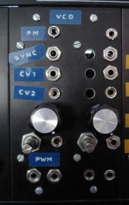

 

Maybe 10 years ago I had put together a dual VCA, dual EG and dual VCF from [PAiA](http://www.paia.com/) kits. They worked great but have mostly sat unused because PAiA ran out of the chips in their VCO kit and no VCO = very little fun. This spring I looked again and found a great DIY synth community on the internet. The ASM VCO #3 had parts I could find and seemed viable so I built up two of them:  These were my first PCB etchings in a long time and first things that I mounted in the frac-rack. I had several trace-patches to do and calibrated these mostly by ear. The back side is a nightmare but they work great. Thankyou for Charlie Lamm for [PC layout](http://www.charlielamm.com/synth/asmvco.php3) and troubleshooting help. 8 
  <!---
  

      
    

            

                            

        

 
Maybe 10 years ago I had put together a dual VCA, dual EG and dual VCF from  <a href="http://www.paia.com/" xmlns="http://www.w3.org/1999/xhtml">PAiA</a>  kits.  They worked great but have mostly sat unused because PAiA ran out of the chips in their VCO kit and no VCO = very little fun.  

This spring I looked again and found a great DIY synth community on the internet.  The ASM VCO #3 had parts I could find and seemed viable so I built up two of them:

  

These were my first PCB etchings in a long time and first things that I mounted in the frac-rack.  I had several trace-patches to do and calibrated these mostly by ear.  The back side is a nightmare but they work great.

Thankyou for Charlie Lamm for  <a href="http://www.charlielamm.com/synth/asmvco.php3" xmlns="http://www.w3.org/1999/xhtml">PC layout</a>  and troubleshooting help. 

 8
  --->