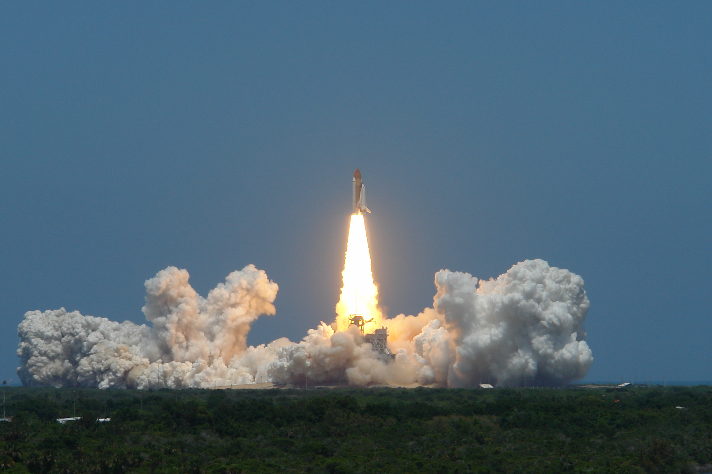
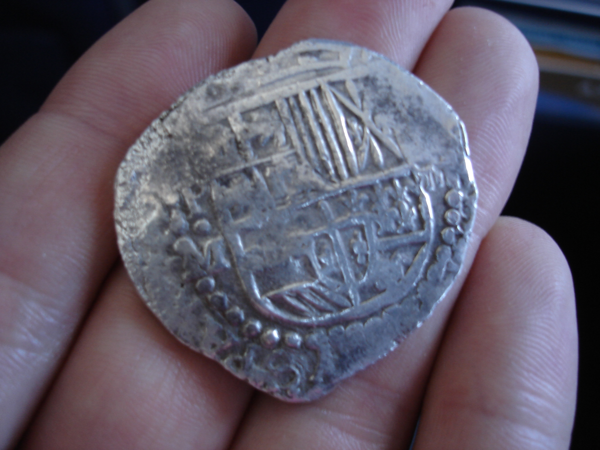
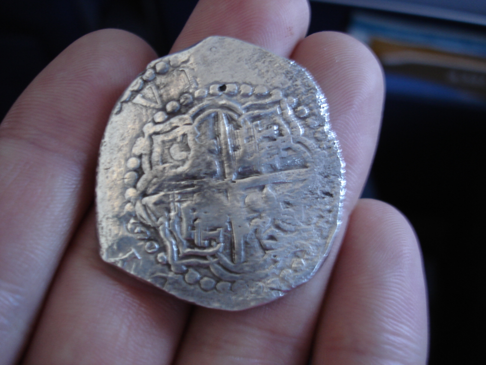
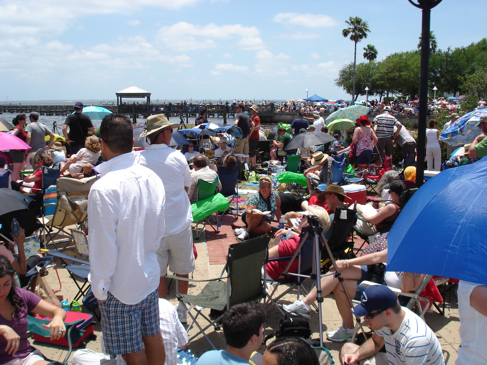

 

Last week I took a fun last-minute trip to watch the last launch of space shuttle Atlantis. On the plane, I sat next to super-nice-guy, marine biologist, and real-life treasure hunter Ken Hayes. He has astronauts for friends and had a VIP pass to Kennedy Space Center! He's interested in storytelling and shared several fascinating ones on the flight from Philly down to Orlando. After the launch, he was headed to the Keys to continue recovery efforts of the famous Spanish galleon [Atocha](http://en.wikipedia.org/wiki/Spanish_ship_Nuestra_Se%C3%B1ora_de_Atocha_%281620%29), lost at sea during hurricane season 1622. He showed me this handmade coin, which is worth about the same now as it was in the 1600's.

An estimated 300,000 people came to watch the third-last space shuttle launch. Here was the view from [Space View Park](http://www.titusville.com/Page.asp?NavID=207).

Ken sent me this picture from where he watched with astronauts and celebrities.

I saw the bright flame and huge smoke plume from my spot in Titusville. And about a minute after liftoff, we heard and felt the constant thunder of the engines start and fade out as the shuttle's tiny dot was lost. A shuttle launch is a truly awesome spectacle and I recommend everyone see one of the last two this fall if you haven't already.

19 
  <!---
  

      
    

            

                            

        

 
 
Last week I took a fun last-minute trip to watch the last launch of space shuttle Atlantis. On the plane, I sat next to super-nice-guy, marine biologist, and real-life treasure hunter Ken Hayes. He has astronauts for friends and had a VIP pass to Kennedy Space Center! He's interested in storytelling and shared several fascinating ones on the flight from Philly down to Orlando. After the launch, he was headed to the Keys to continue recovery efforts of the famous Spanish galleon <a href="http://en.wikipedia.org/wiki/Spanish_ship_Nuestra_Se%C3%B1ora_de_Atocha_%281620%29">Atocha</a>, lost at sea during hurricane season 1622. He showed me this handmade coin, which is worth about the same now as it was in the 1600's.
 

 

 

 

 

 
An estimated 300,000 people came to watch the third-last space shuttle launch. Here was the view from <a href="http://www.titusville.com/Page.asp?NavID=207">Space View Park</a>.
 

 

 

 
Ken sent me this picture from where he watched with astronauts and celebrities.
 

 

 

 
I saw the bright flame and huge smoke plume from my spot in Titusville. And about a minute after liftoff, we heard and felt the constant thunder of the engines start and fade out as the shuttle's tiny dot was lost. A shuttle launch is a truly awesome spectacle and I recommend everyone see one of the last two this fall if you haven't already.
 

  19
  --->